CharityNavigatorRating
================
Max Mershon
19 Mar 2019

1. Data Understanding
=====================

Pull Data
---------

``` r
data = read.csv("Charities_Data.csv")
str(data)
```

    ## 'data.frame':    8631 obs. of  29 variables:
    ##  $ ID                                                                             : int  1 2 3 4 5 6 7 8 9 10 ...
    ##  $ Name                                                                           : Factor w/ 8631 levels "'Aha PÅ«nana Leo - HI",..: 3 4 5 6 7 8 9 10 6907 6908 ...
    ##  $ Link                                                                           : Factor w/ 8631 levels "http://www.charitynavigator.org/index.cfm?bay=search.summary&orgid=10000",..: 6511 1186 1199 57 7884 3225 3880 1712 2026 5482 ...
    ##  $ EIN                                                                            : Factor w/ 8631 levels "01-0202467","01-0211478",..: 8446 5646 2269 5946 7831 1605 2578 2787 1055 713 ...
    ##  $ Overall.Rating                                                                 : num  90.2 88.5 90.6 88.1 91.9 ...
    ##  $ Program.Expenses                                                               : num  0.703 0.866 0.846 0.788 0.714 0.856 0.833 0.872 0.766 0.851 ...
    ##  $ Administrative.Expenses                                                        : Factor w/ 373 levels "< 0.1%","0.0010",..: 150 109 125 152 102 69 135 76 119 96 ...
    ##  $ Fundraising.Expenses                                                           : Factor w/ 372 levels "< 0.1%","0.0010",..: 147 26 30 60 185 76 33 52 116 54 ...
    ##  $ Fundraising.Efficiency                                                         : Factor w/ 83 levels "< $0.01","0.02",..: 13 2 4 6 18 9 2 7 13 10 ...
    ##  $ Working.Capital.Ratio..years.                                                  : Factor w/ 951 levels "< 0.01","0.01",..: 113 103 63 80 363 1 105 142 938 46 ...
    ##  $ Program.Expenses.Growth                                                        : Factor w/ 762 levels "-0.0010","-0.0020",..: 343 305 10 87 382 415 419 510 327 307 ...
    ##  $ Liabilities.to.Assets                                                          : Factor w/ 927 levels "-0.0040","-0.0190",..: 34 193 102 75 21 863 94 344 9 190 ...
    ##  $ Independent.Voting.Board.Members                                               : logi  TRUE TRUE TRUE TRUE TRUE TRUE ...
    ##  $ No.Material.diversion.of.assets                                                : logi  TRUE TRUE TRUE TRUE TRUE TRUE ...
    ##  $ Audited.financials.prepared.by.independent.accountant                          : logi  TRUE TRUE TRUE TRUE TRUE TRUE ...
    ##  $ Does.Not.Provide.Loan.s..to.or.Receive.Loan.s..From.related.parties            : logi  TRUE TRUE TRUE TRUE TRUE TRUE ...
    ##  $ Documents.Board.Meeting.Minutes                                                : logi  TRUE TRUE TRUE TRUE TRUE TRUE ...
    ##  $ Provided.copy.of.Form.990.to.organization.s.governing.body.in.advance.of.filing: logi  TRUE TRUE TRUE TRUE TRUE TRUE ...
    ##  $ Conflict.of.Interest.Policy                                                    : logi  TRUE TRUE TRUE TRUE TRUE TRUE ...
    ##  $ Whistleblower.Policy                                                           : logi  TRUE TRUE TRUE TRUE TRUE TRUE ...
    ##  $ Records.Retention.and.Destruction.Policy                                       : logi  TRUE TRUE TRUE TRUE TRUE TRUE ...
    ##  $ CEO.listed.with.salary                                                         : logi  TRUE TRUE TRUE TRUE TRUE TRUE ...
    ##  $ Process.for.determining.CEO.compensation                                       : logi  TRUE TRUE FALSE TRUE TRUE TRUE ...
    ##  $ Board.Listed...Board.Members.Not.Compensated                                   : logi  TRUE TRUE TRUE TRUE TRUE TRUE ...
    ##  $ Donor.Privacy.Policy                                                           : logi  FALSE FALSE FALSE TRUE TRUE FALSE ...
    ##  $ Board.Members.Listed                                                           : logi  TRUE TRUE TRUE TRUE TRUE TRUE ...
    ##  $ Audited.Financials                                                             : logi  TRUE FALSE TRUE TRUE TRUE FALSE ...
    ##  $ Form.990                                                                       : logi  TRUE FALSE TRUE TRUE TRUE FALSE ...
    ##  $ Key.staff.listed                                                               : logi  TRUE FALSE TRUE TRUE TRUE TRUE ...

Clean Numeric Variables
-----------------------

Replace categorical occurence with a `-1` and remove them.

``` r
data_clean <- data %>%
  filter(Administrative.Expenses != "< 0.1%") %>%
  filter(Fundraising.Expenses != "< 0.1%") %>%
  filter(Fundraising.Efficiency != "< $0.01") %>%
  filter(Working.Capital.Ratio..years. != "< 0.01") %>%
  filter(Program.Expenses.Growth != "< 0.1%") %>%
  filter(Liabilities.to.Assets != "< 0.1%")

data_clean <- data_clean %>%
  mutate(Administrative.Expenses = as.numeric(levels(data_clean[,7])[data_clean[,7]])) %>%
  mutate(Fundraising.Expenses = as.numeric(levels(data_clean[,8])[data_clean[,8]])) %>%
  mutate(Fundraising.Efficiency = as.numeric(levels(data_clean[,9])[data_clean[,9]])) %>%
  mutate(Working.Capital.Ratio..years. = as.numeric(levels(data_clean[,10])[data_clean[,10]])) %>%
  mutate(Program.Expenses.Growth = as.numeric(levels(data_clean[,11])[data_clean[,11]])) %>%
  mutate(Liabilities.to.Assets = as.numeric(levels(data_clean[,12])[data_clean[,12]]))

data_clean <- data_clean %>%
  select( -c(Name, Link, EIN))

nrow(data_clean)
```

    ## [1] 7772

Descriptive Statistics
----------------------

``` r
summary(select(data_clean, c(2:9)))
```

    ##  Overall.Rating   Program.Expenses Administrative.Expenses
    ##  Min.   : 18.95   Min.   :0.0290   Min.   :0.001          
    ##  1st Qu.: 83.42   1st Qu.:0.7520   1st Qu.:0.065          
    ##  Median : 88.24   Median :0.8080   Median :0.096          
    ##  Mean   : 86.94   Mean   :0.7966   Mean   :0.107          
    ##  3rd Qu.: 91.91   3rd Qu.:0.8560   3rd Qu.:0.136          
    ##  Max.   :100.00   Max.   :0.9790   Max.   :0.746          
    ##  Fundraising.Expenses Fundraising.Efficiency Working.Capital.Ratio..years.
    ##  Min.   :0.00400      Min.   :0.0200         Min.   : 0.010               
    ##  1st Qu.:0.05200      1st Qu.:0.0600         1st Qu.: 0.580               
    ##  Median :0.08300      Median :0.1000         Median : 1.220               
    ##  Mean   :0.09485      Mean   :0.1162         Mean   : 2.011               
    ##  3rd Qu.:0.12100      3rd Qu.:0.1500         3rd Qu.: 2.470               
    ##  Max.   :0.91800      Max.   :1.4300         Max.   :59.140               
    ##  Program.Expenses.Growth Liabilities.to.Assets
    ##  Min.   :-0.5470         Min.   :-0.0190      
    ##  1st Qu.: 0.0030         1st Qu.: 0.0340      
    ##  Median : 0.0450         Median : 0.0950      
    ##  Mean   : 0.0592         Mean   : 0.1652      
    ##  3rd Qu.: 0.0990         3rd Qu.: 0.2280      
    ##  Max.   : 5.3450         Max.   :24.9400

Histograms of Numeric Variables
-------------------------------

``` r
for (i in colnames(select(data_clean, c(2:9)))){
  hist(data_clean[[i]], main = paste("Histogram of" , colnames(data_clean[i])))
}
```

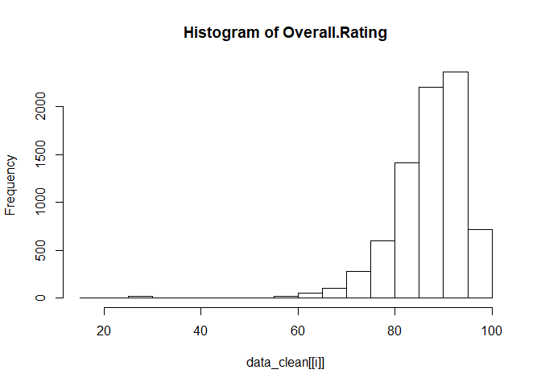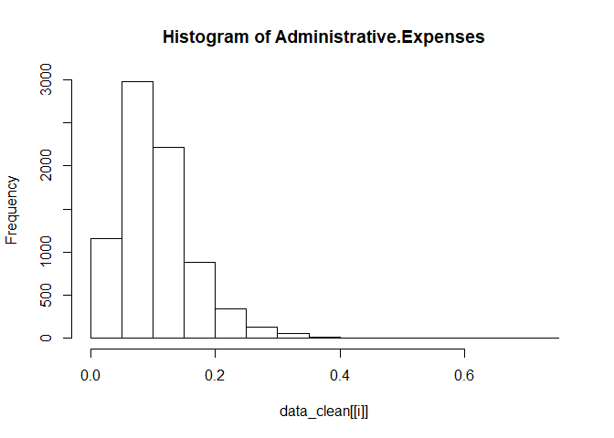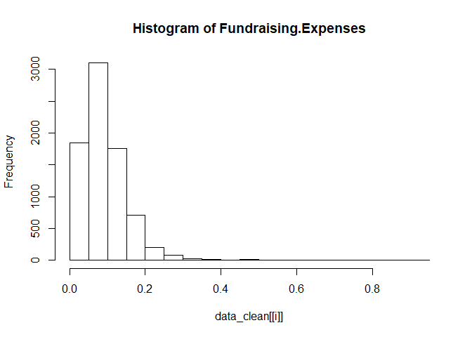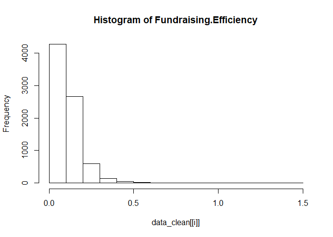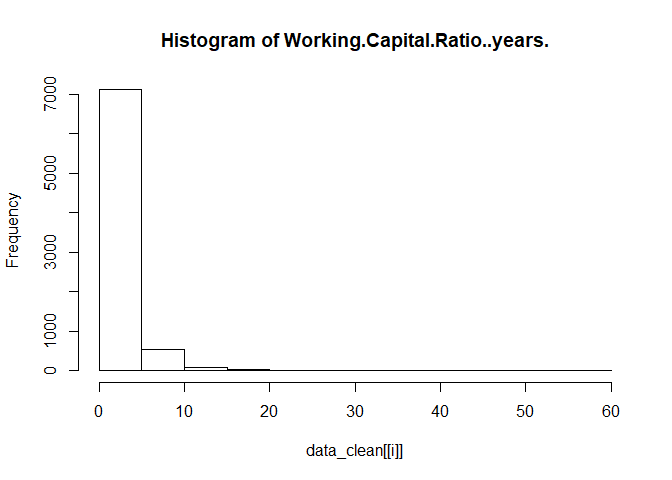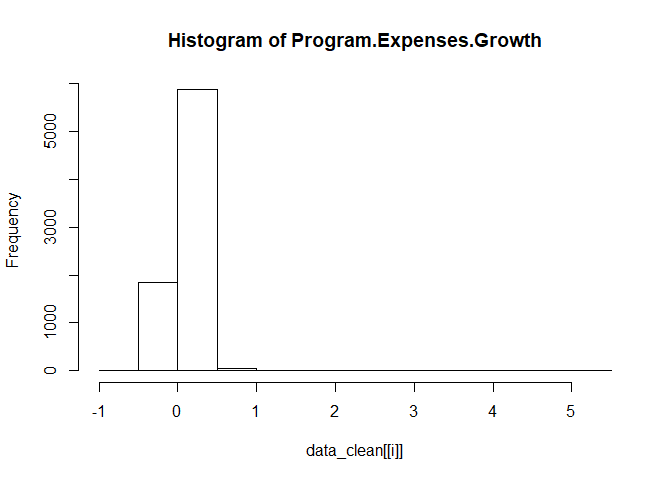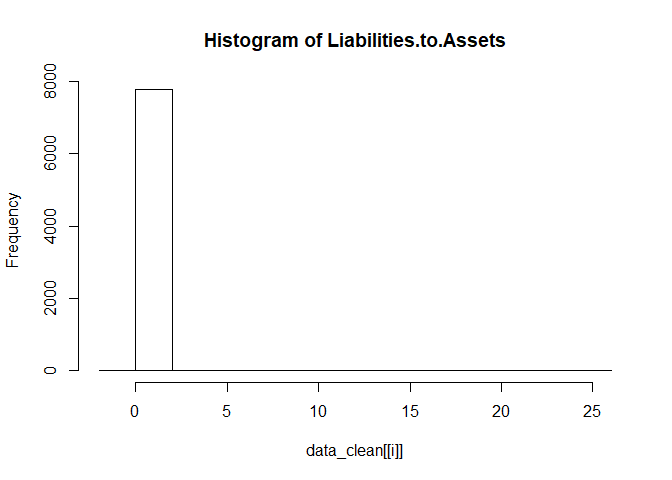

Frequency Charts of True/False Variables
----------------------------------------

``` r
for (i in colnames(select(data_clean, c(10:26)))){
  print(ggplot(data_clean, aes(x = data_clean[[i]])) +
    geom_bar(stat = "count") + 
    xlab(colnames(data_clean[i])))
}
```

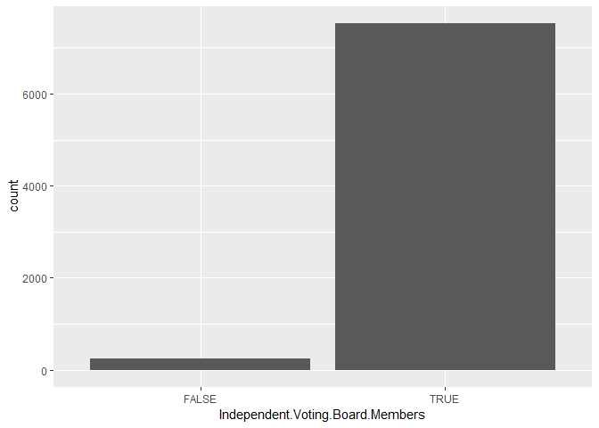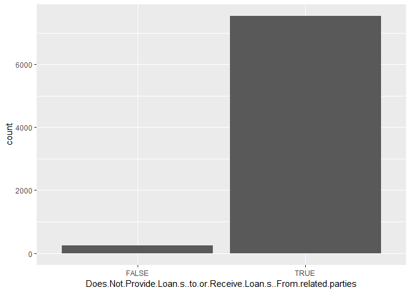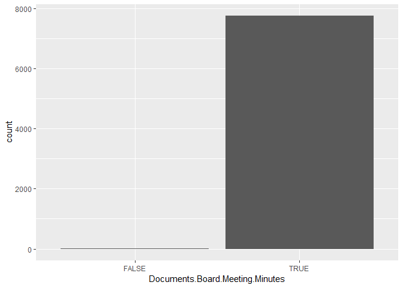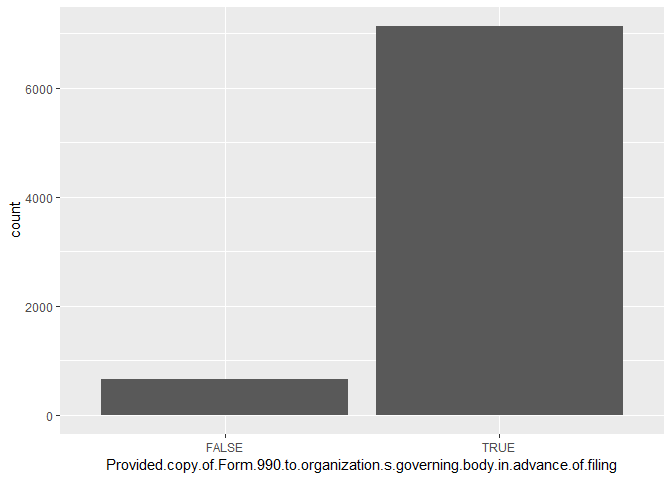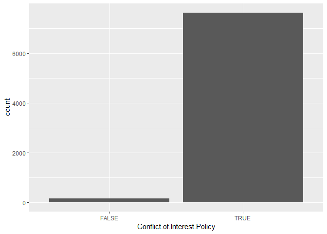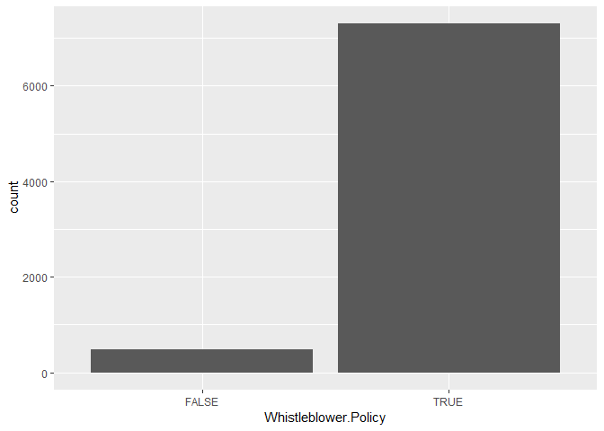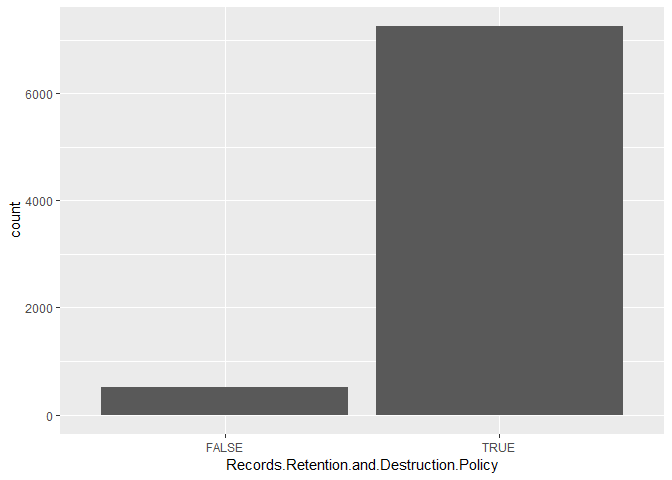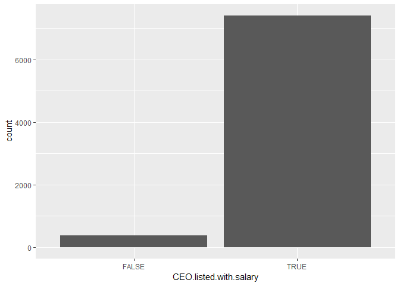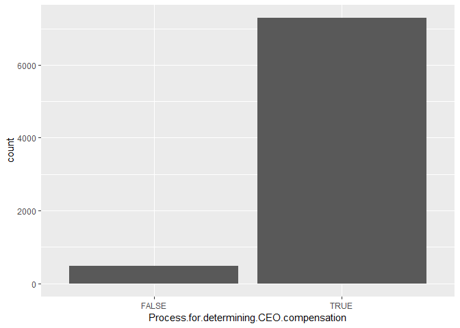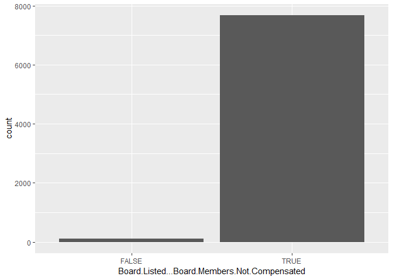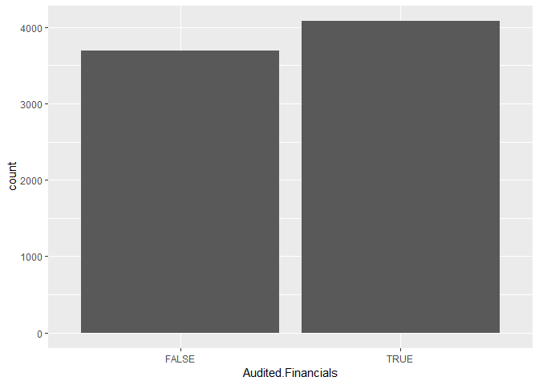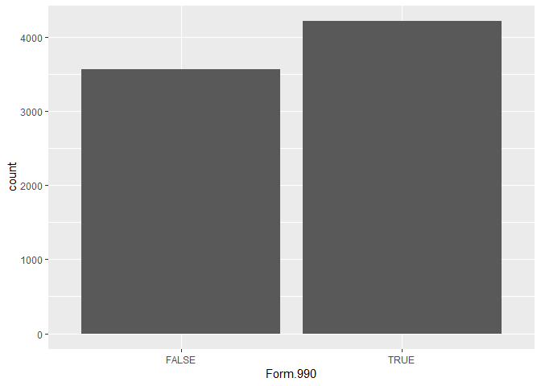

Correlations amongst numeric variables
--------------------------------------

``` r
ggpairs(select(data_clean, c(2:9)), progress = FALSE)
```


2. Modeling
===========

Linear Regression
-----------------

Calcuate MAE using CV for initial linear regression model.

``` r
set.seed(123)

reg_mod <- train(Overall.Rating ~ . - ID, 
             data = data_clean, 
             trControl = trainControl(method = "cv", number = 5),
             method = "lm")

reg_mod.mae_min <- reg_mod$results$MAE
reg_mod.mae_min
```

    ## [1] 2.565543

Check linearity of errors and constant variance of errors (Fitted vs. Residuals plot)

``` r
reg <- lm(Overall.Rating ~ . - ID, data_clean)
plot(reg)
```

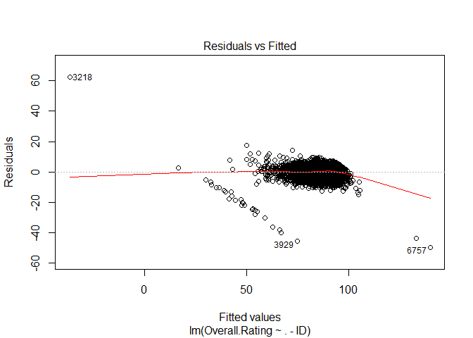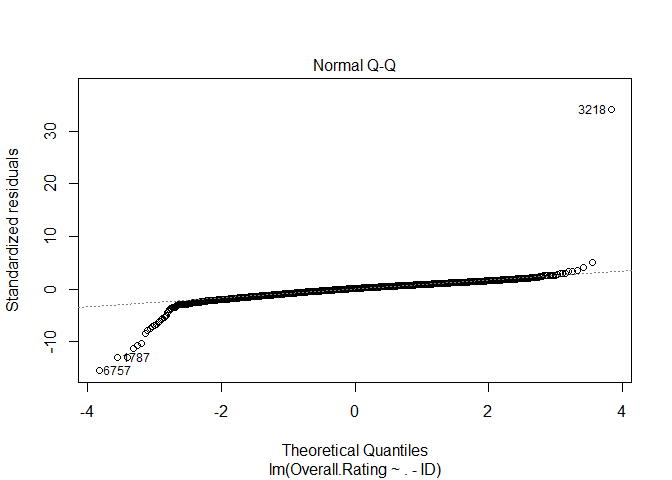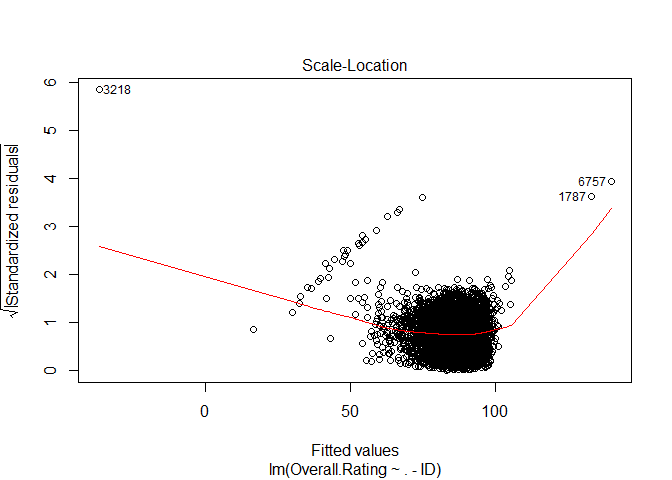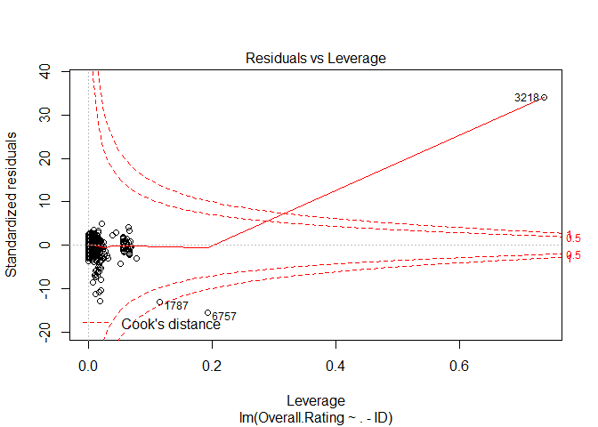

Remove outliers (Cook's Distance &gt; .5)

``` r
results <- augment(reg)

outlies <- results %>%
  filter(.cooksd >= 0.5)

data_clean <- data_clean %>%
  filter(!ID %in% outlies$ID)
```

Remove leverage points (Hat &gt; .04)

``` r
leverage <- results %>%
  filter(.hat >= 0.04)

data_clean <- data_clean %>%
  filter(!ID %in% leverage$ID)
```

Refit model

``` r
reg <- lm(Overall.Rating ~ . - ID, data_clean)
tidy(summary(reg))
```

    ## # A tibble: 23 x 5
    ##    term                              estimate std.error statistic   p.value
    ##    <chr>                                <dbl>     <dbl>     <dbl>     <dbl>
    ##  1 (Intercept)                         42.3     71.2        0.594 5.52e-  1
    ##  2 Program.Expenses                    17.6     71.3        0.246 8.06e-  1
    ##  3 Administrative.Expenses            -12.5     71.3       -0.175 8.61e-  1
    ##  4 Fundraising.Expenses               -26.1     71.3       -0.366 7.14e-  1
    ##  5 Fundraising.Efficiency             -10.0      0.630    -15.9   6.21e- 56
    ##  6 Working.Capital.Ratio..years.        0.215    0.0165    13.0   2.83e- 38
    ##  7 Program.Expenses.Growth             14.1      0.315     44.8   0.       
    ##  8 Liabilities.to.Assets               -9.81     0.215    -45.7   0.       
    ##  9 Independent.Voting.Board.Members~    8.44     0.218     38.7   6.78e-299
    ## 10 Audited.financials.prepared.by.i~    6.27     0.143     43.9   0.       
    ## # ... with 13 more rows

Remove `No.Material.diversion.of.assets` and `Documents.Board.Meeting.Minutes` because all values are True and then refit.

``` r
reg <- lm(Overall.Rating ~ . - ID - No.Material.diversion.of.assets - Documents.Board.Meeting.Minutes, data_clean)
tidy(summary(reg))
```

    ## # A tibble: 23 x 5
    ##    term                              estimate std.error statistic   p.value
    ##    <chr>                                <dbl>     <dbl>     <dbl>     <dbl>
    ##  1 (Intercept)                         42.3     71.2        0.594 5.52e-  1
    ##  2 Program.Expenses                    17.6     71.3        0.246 8.06e-  1
    ##  3 Administrative.Expenses            -12.5     71.3       -0.175 8.61e-  1
    ##  4 Fundraising.Expenses               -26.1     71.3       -0.366 7.14e-  1
    ##  5 Fundraising.Efficiency             -10.0      0.630    -15.9   6.21e- 56
    ##  6 Working.Capital.Ratio..years.        0.215    0.0165    13.0   2.83e- 38
    ##  7 Program.Expenses.Growth             14.1      0.315     44.8   0.       
    ##  8 Liabilities.to.Assets               -9.81     0.215    -45.7   0.       
    ##  9 Independent.Voting.Board.Members~    8.44     0.218     38.7   6.78e-299
    ## 10 Audited.financials.prepared.by.i~    6.27     0.143     43.9   0.       
    ## # ... with 13 more rows

Remove `Administrative.Expenses` because highest statistically insignificant pvalue and refit.

``` r
reg <- lm(Overall.Rating ~ . - ID - No.Material.diversion.of.assets - Documents.Board.Meeting.Minutes - Administrative.Expenses, data_clean)
tidy(summary(reg))
```

    ## # A tibble: 22 x 5
    ##    term                              estimate std.error statistic   p.value
    ##    <chr>                                <dbl>     <dbl>     <dbl>     <dbl>
    ##  1 (Intercept)                         29.9      0.734      40.7  0.       
    ##  2 Program.Expenses                    30.0      0.629      47.8  0.       
    ##  3 Fundraising.Expenses               -13.6      0.991     -13.7  1.62e- 42
    ##  4 Fundraising.Efficiency             -10.0      0.630     -15.9  6.20e- 56
    ##  5 Working.Capital.Ratio..years.        0.215    0.0165     13.0  2.84e- 38
    ##  6 Program.Expenses.Growth             14.1      0.315      44.8  0.       
    ##  7 Liabilities.to.Assets               -9.81     0.215     -45.7  0.       
    ##  8 Independent.Voting.Board.Members~    8.44     0.218      38.7  6.25e-299
    ##  9 Audited.financials.prepared.by.i~    6.28     0.143      43.9  0.       
    ## 10 Does.Not.Provide.Loan.s..to.or.R~    1.28     0.212       6.06 1.39e-  9
    ## # ... with 12 more rows

Plot results.

``` r
plot(reg)
```

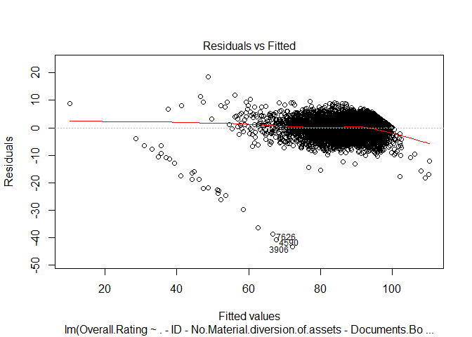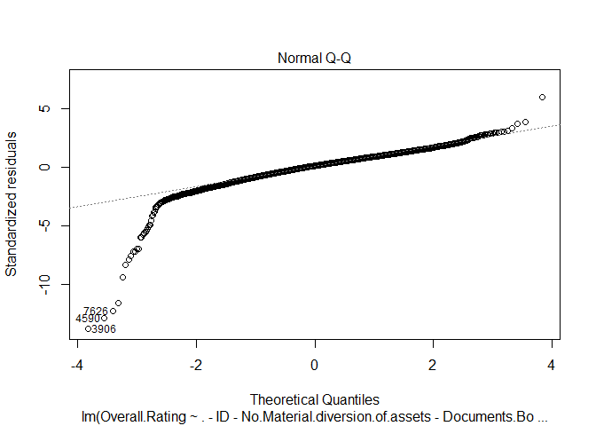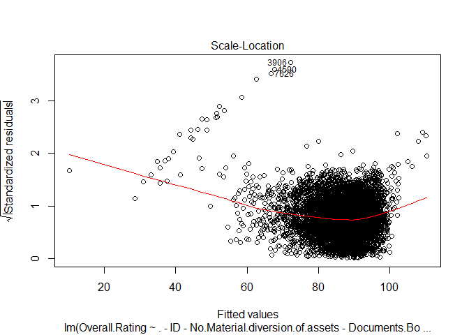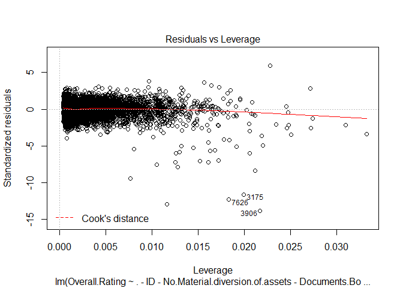

Plot residuals for each continuous input variable.

``` r
results <- augment(reg)

for (i in colnames(select(results, c(3:9)))){
  print(ggplot(results, aes(x = results[[i]], y = results[[29]])) +
    geom_point() + 
    xlab(colnames(results[i])))
}
```

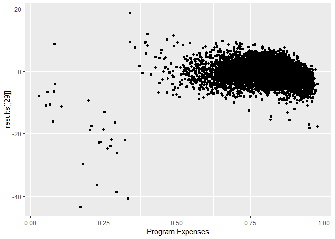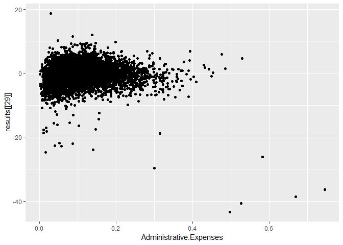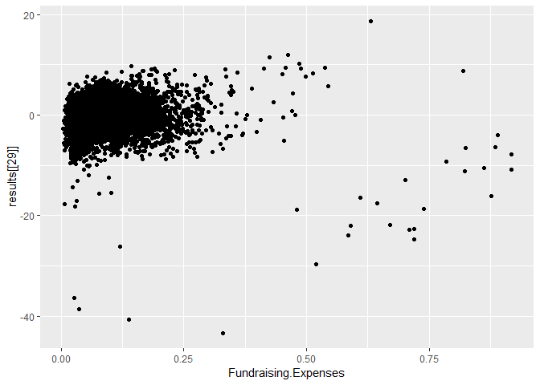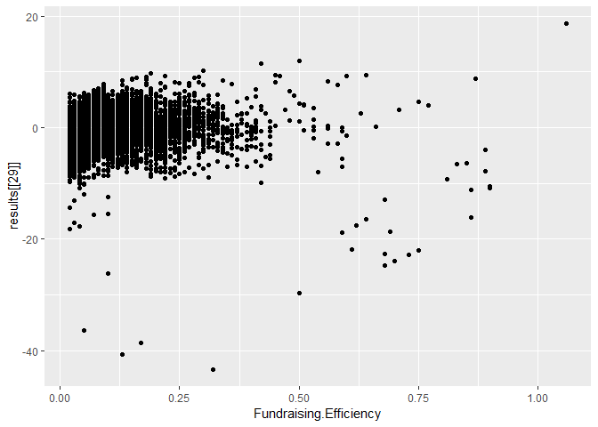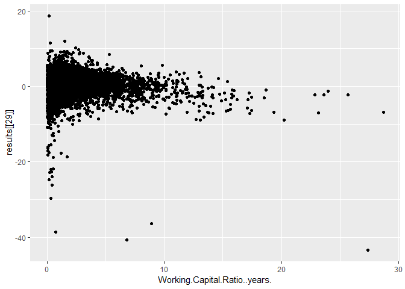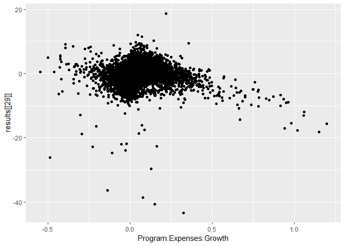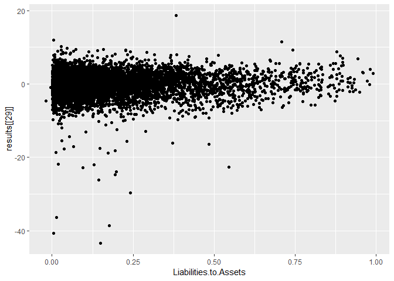

Recalculate CV MAE for final regression model.

``` r
set.seed(123)

reg_mod2 <- train(Overall.Rating ~ . - ID - No.Material.diversion.of.assets - Documents.Board.Meeting.Minutes - Administrative.Expenses, 
             data = data_clean, 
             trControl = trainControl(method = "cv", number = 5),
             method = "lm")

reg_mod2.mae_min <- reg_mod2$results$MAE
reg_mod2.mae_min
```

    ## [1] 2.305512

Lasso Linear Regression
-----------------------

Calculate CV MAE for tuned lasso linear regression after trying different values of lambda.

``` r
set.seed(123)
lambdas <- 10^seq(-2, 5, len = 100)

data_clean_matrix<- model.matrix(Overall.Rating ~ . - ID - No.Material.diversion.of.assets - Documents.Board.Meeting.Minutes, data = data_clean)[, -1]

reg_lasso <- cv.glmnet(data_clean_matrix, 
                       data_clean$Overall.Rating, 
                       alpha = 1, 
                       lambda = lambdas,
                       type.measure = "mae",
                       nfolds = 5,
                       standardize = TRUE)

reg_lasso.mae_min <- reg_lasso$cvm[reg_lasso$lambda == reg_lasso$lambda.min]
reg_lasso.mae_min
```

    ## [1] 2.306128

GAM
---

Calculate CV MAE for tuned GAM after trying different degrees of freedom.

``` r
set.seed(123)

gam_mod <- train(Overall.Rating ~ . - ID - No.Material.diversion.of.assets - Documents.Board.Meeting.Minutes, 
                  data = data_clean,
                  method = "gamSpline",
                  trControl = trainControl(method = "cv", number = 5),
                  tuneGrid = data.frame(df = 1:6)
)
```

    ## Loading required package: gam

    ## Warning: package 'gam' was built under R version 3.5.3

    ## Loading required package: splines

    ## Loaded gam 1.16

    ## 
    ## Attaching package: 'gam'

    ## The following objects are masked from 'package:mgcv':
    ## 
    ##     gam, gam.control, gam.fit, s

``` r
gam_mod.mae_min <- min(gam_mod$results$MAE)
gam_mod.mae_min
```

    ## [1] 1.813271

Decision Tree
-------------

Calculate CV MAE for tuned decision tree after trying different tree depths.

``` r
set.seed(123)

dtree <- train(Overall.Rating ~ . - ID - No.Material.diversion.of.assets - Documents.Board.Meeting.Minutes, 
               data = data_clean, 
               trControl = trainControl(method = "cv", number = 5),
               method = "rpart2",
               tuneGrid = data.frame(maxdepth = 1:5))

dtree.mae_min <- min(dtree$results$MAE)
dtree.mae_min
```

    ## [1] 3.442917

Bagged Trees
------------

Calculate CV MAE for bagged decision trees.

``` r
set.seed(123)

bag_mod <- train(Overall.Rating ~ . - ID - No.Material.diversion.of.assets - Documents.Board.Meeting.Minutes, 
               data = data_clean, 
               trControl = trainControl(method = "cv", number = 5),
               method = "treebag",
               importance = T)

bag_mod.mae_min <- min(bag_mod$results$MAE)
bag_mod.mae_min
```

    ## [1] 3.024058

Random Forest
-------------

Calculate CV MAE for tuned random forest after trying different number of variables used in each tree.

``` r
set.seed(123)

rf_mod <- train(Overall.Rating ~ . - ID - No.Material.diversion.of.assets - Documents.Board.Meeting.Minutes, 
               data = data_clean, 
               trControl = trainControl(method = "cv", number = 5),
               method = "rf",
               ntree = 100,
               importance = T,
               tuneGrid = data.frame(mtry = 1:5))

rf_mod.mae_min <- min(rf_mod$results$MAE)
rf_mod.mae_min 
```

    ## [1] 1.504477

Boosted Forest
--------------

Calculate CV MAE for tuned boosted random forest after trying different number of trees, tree depths, and shrinkage parameters.

``` r
set.seed(123)

grid <- expand.grid(interaction.depth = c(1, 3, 5), 
                    n.trees = c(100, 250, 500),
                    shrinkage = c(.01, 0.001),
                    n.minobsinnode = 10)

gbm_mod <- train(Overall.Rating ~ . - ID - No.Material.diversion.of.assets - Documents.Board.Meeting.Minutes, 
                 data = data_clean, 
                 distribution = "gaussian", 
                 method = "gbm",
                 trControl = trainControl(method = "cv", number = 5), 
                 tuneGrid = grid,
                 verbose = FALSE)

gbm_mod.mae_min <- min(gbm_mod$results$MAE)
gbm_mod.mae_min
```

    ## [1] 1.576197

Neural Net
----------

Calculate CV MAE for tuned neural net after trying different number of nodes and rates of decay.

``` r
set.seed(123)

grid <- expand.grid(size = 1:5,
                    decay = c(.01, .5, 1))

nn_mod <- train(Overall.Rating ~ . - ID - No.Material.diversion.of.assets - Documents.Board.Meeting.Minutes,
                 data = data_clean,
                 method = "nnet",
                 tuneGrid = grid,
                 trControl = trainControl(method = "cv", number = 5), 
                 maxit = 500,
                 linout = TRUE,
                 verbose = FALSE,
                 trace = FALSE)
```

    ## Warning in nominalTrainWorkflow(x = x, y = y, wts = weights, info =
    ## trainInfo, : There were missing values in resampled performance measures.

``` r
nn_mod.mae_min <- min(nn_mod$results$MAE)
nn_mod.mae_min
```

    ## [1] 1.484909

3. Conclusion
=============

Summary of Results
------------------

``` r
results <- data.frame("Models" = c("Linear Regression (Initial)", "Linear Regression (Tuned)", "Lasso Regression", "GAM", 
                                   "Decision Tree", "Bagged Trees", "Random Forest", "Boosted Forest", "Neural Net"),
            "MAE" = c(reg_mod.mae_min, reg_mod2.mae_min, reg_lasso.mae_min, gam_mod.mae_min, 
                      dtree.mae_min, bag_mod.mae_min, rf_mod.mae_min, gbm_mod.mae_min, nn_mod.mae_min))

results <- results %>%
  mutate(MAE = round(MAE, 2)) %>%
  arrange(MAE)

results
```

    ##                        Models  MAE
    ## 1                  Neural Net 1.48
    ## 2               Random Forest 1.50
    ## 3              Boosted Forest 1.58
    ## 4                         GAM 1.81
    ## 5   Linear Regression (Tuned) 2.31
    ## 6            Lasso Regression 2.31
    ## 7 Linear Regression (Initial) 2.57
    ## 8                Bagged Trees 3.02
    ## 9               Decision Tree 3.44

Refit tuned linear regression

``` r
reg <- lm(Overall.Rating ~ . - ID - No.Material.diversion.of.assets - Documents.Board.Meeting.Minutes - Administrative.Expenses, data_clean)
tidy(summary(reg))
```

    ## # A tibble: 22 x 5
    ##    term                              estimate std.error statistic   p.value
    ##    <chr>                                <dbl>     <dbl>     <dbl>     <dbl>
    ##  1 (Intercept)                         29.9      0.734      40.7  0.       
    ##  2 Program.Expenses                    30.0      0.629      47.8  0.       
    ##  3 Fundraising.Expenses               -13.6      0.991     -13.7  1.62e- 42
    ##  4 Fundraising.Efficiency             -10.0      0.630     -15.9  6.20e- 56
    ##  5 Working.Capital.Ratio..years.        0.215    0.0165     13.0  2.84e- 38
    ##  6 Program.Expenses.Growth             14.1      0.315      44.8  0.       
    ##  7 Liabilities.to.Assets               -9.81     0.215     -45.7  0.       
    ##  8 Independent.Voting.Board.Members~    8.44     0.218      38.7  6.25e-299
    ##  9 Audited.financials.prepared.by.i~    6.28     0.143      43.9  0.       
    ## 10 Does.Not.Provide.Loan.s..to.or.R~    1.28     0.212       6.06 1.39e-  9
    ## # ... with 12 more rows

Calculate predictions for tuned linear regression

``` r
data_clean$reg_prediction  <- predict(reg, data_clean)
```

Calculate final MAE for tuned linear regression and random forest

``` r
data_clean <- data_clean %>%
  mutate(reg_error  = Overall.Rating - reg_prediction)
```
