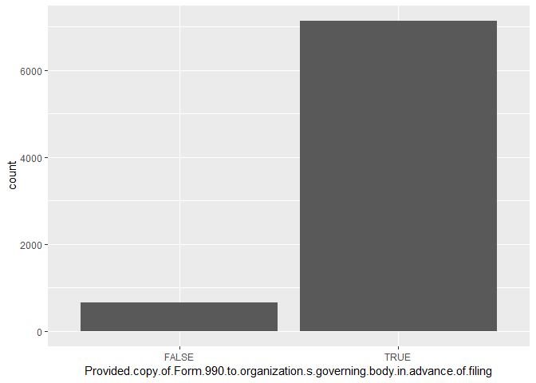

CharityNavigatorRating
================
Max Mershon
27 Feb 2019

Data Understanding
==================

Pull Data
---------

``` r
data = read.csv("../Charities_Data.csv")
str(data)
```

    ## 'data.frame':    8631 obs. of  29 variables:
    ##  $ ID                                                                             : int  1 2 3 4 5 6 7 8 9 10 ...
    ##  $ Name                                                                           : Factor w/ 8631 levels "'Aha PÅ«nana Leo - HI",..: 3 4 5 6 7 8 9 10 6907 6908 ...
    ##  $ Link                                                                           : Factor w/ 8631 levels "http://www.charitynavigator.org/index.cfm?bay=search.summary&orgid=10000",..: 6511 1186 1199 57 7884 3225 3880 1712 2026 5482 ...
    ##  $ EIN                                                                            : Factor w/ 8631 levels "01-0202467","01-0211478",..: 8446 5646 2269 5946 7831 1605 2578 2787 1055 713 ...
    ##  $ Overall.Rating                                                                 : num  90.2 88.5 90.6 88.1 91.9 ...
    ##  $ Program.Expenses                                                               : num  0.703 0.866 0.846 0.788 0.714 0.856 0.833 0.872 0.766 0.851 ...
    ##  $ Administrative.Expenses                                                        : Factor w/ 373 levels "< 0.1%","0.0010",..: 150 109 125 152 102 69 135 76 119 96 ...
    ##  $ Fundraising.Expenses                                                           : Factor w/ 372 levels "< 0.1%","0.0010",..: 147 26 30 60 185 76 33 52 116 54 ...
    ##  $ Fundraising.Efficiency                                                         : Factor w/ 83 levels "< $0.01","0.02",..: 13 2 4 6 18 9 2 7 13 10 ...
    ##  $ Working.Capital.Ratio..years.                                                  : Factor w/ 951 levels "< 0.01","0.01",..: 113 103 63 80 363 1 105 142 938 46 ...
    ##  $ Program.Expenses.Growth                                                        : Factor w/ 762 levels "-0.0010","-0.0020",..: 343 305 10 87 382 415 419 510 327 307 ...
    ##  $ Liabilities.to.Assets                                                          : Factor w/ 927 levels "-0.0040","-0.0190",..: 34 193 102 75 21 863 94 344 9 190 ...
    ##  $ Independent.Voting.Board.Members                                               : logi  TRUE TRUE TRUE TRUE TRUE TRUE ...
    ##  $ No.Material.diversion.of.assets                                                : logi  TRUE TRUE TRUE TRUE TRUE TRUE ...
    ##  $ Audited.financials.prepared.by.independent.accountant                          : logi  TRUE TRUE TRUE TRUE TRUE TRUE ...
    ##  $ Does.Not.Provide.Loan.s..to.or.Receive.Loan.s..From.related.parties            : logi  TRUE TRUE TRUE TRUE TRUE TRUE ...
    ##  $ Documents.Board.Meeting.Minutes                                                : logi  TRUE TRUE TRUE TRUE TRUE TRUE ...
    ##  $ Provided.copy.of.Form.990.to.organization.s.governing.body.in.advance.of.filing: logi  TRUE TRUE TRUE TRUE TRUE TRUE ...
    ##  $ Conflict.of.Interest.Policy                                                    : logi  TRUE TRUE TRUE TRUE TRUE TRUE ...
    ##  $ Whistleblower.Policy                                                           : logi  TRUE TRUE TRUE TRUE TRUE TRUE ...
    ##  $ Records.Retention.and.Destruction.Policy                                       : logi  TRUE TRUE TRUE TRUE TRUE TRUE ...
    ##  $ CEO.listed.with.salary                                                         : logi  TRUE TRUE TRUE TRUE TRUE TRUE ...
    ##  $ Process.for.determining.CEO.compensation                                       : logi  TRUE TRUE FALSE TRUE TRUE TRUE ...
    ##  $ Board.Listed...Board.Members.Not.Compensated                                   : logi  TRUE TRUE TRUE TRUE TRUE TRUE ...
    ##  $ Donor.Privacy.Policy                                                           : logi  FALSE FALSE FALSE TRUE TRUE FALSE ...
    ##  $ Board.Members.Listed                                                           : logi  TRUE TRUE TRUE TRUE TRUE TRUE ...
    ##  $ Audited.Financials                                                             : logi  TRUE FALSE TRUE TRUE TRUE FALSE ...
    ##  $ Form.990                                                                       : logi  TRUE FALSE TRUE TRUE TRUE FALSE ...
    ##  $ Key.staff.listed                                                               : logi  TRUE FALSE TRUE TRUE TRUE TRUE ...

Clean Numeric Variables
-----------------------

Count number of categorical occurences within each numeric variable.

``` r
count(data, "Administrative.Expenses")
```

    ##     Administrative.Expenses freq
    ## 1                    < 0.1%    3
    ## 2                    0.0010    3
    ## 3                    0.0020    7
    ## 4                    0.0030   11
    ## 5                    0.0040    8
    ## 6                    0.0050    7
    ## 7                    0.0060   15
    ## 8                    0.0070   13
    ## 9                    0.0080   13
    ## 10                   0.0090   12
    ## 11                   0.0100   17
    ## 12                   0.0110   18
    ## 13                   0.0120   23
    ## 14                   0.0130   21
    ## 15                   0.0140   14
    ## 16                   0.0150   28
    ## 17                   0.0160   27
    ## 18                   0.0170   26
    ## 19                   0.0180   22
    ## 20                   0.0190   30
    ## 21                   0.0200   24
    ## 22                   0.0210   24
    ## 23                   0.0220   23
    ## 24                   0.0230   22
    ## 25                   0.0240   21
    ## 26                   0.0250   25
    ## 27                   0.0260   23
    ## 28                   0.0270   42
    ## 29                   0.0280   31
    ## 30                   0.0290   39
    ## 31                   0.0300   36
    ## 32                   0.0310   31
    ## 33                   0.0320   30
    ## 34                   0.0330   29
    ## 35                   0.0340   34
    ## 36                   0.0350   36
    ## 37                   0.0360   33
    ## 38                   0.0370   43
    ## 39                   0.0380   28
    ## 40                   0.0390   38
    ## 41                   0.0400   49
    ## 42                   0.0410   35
    ## 43                   0.0420   45
    ## 44                   0.0430   58
    ## 45                   0.0440   53
    ## 46                   0.0450   44
    ## 47                   0.0460   41
    ## 48                   0.0470   55
    ## 49                   0.0480   52
    ## 50                   0.0490   59
    ## 51                   0.0500   50
    ## 52                   0.0510   45
    ## 53                   0.0520   46
    ## 54                   0.0530   54
    ## 55                   0.0540   62
    ## 56                   0.0550   57
    ## 57                   0.0560   50
    ## 58                   0.0570   66
    ## 59                   0.0580   61
    ## 60                   0.0590   50
    ## 61                   0.0600   61
    ## 62                   0.0610   75
    ## 63                   0.0620   77
    ## 64                   0.0630   70
    ## 65                   0.0640   64
    ## 66                   0.0650   74
    ## 67                   0.0660   65
    ## 68                   0.0670   75
    ## 69                   0.0680   56
    ## 70                   0.0690   42
    ## 71                   0.0700   55
    ## 72                   0.0710   72
    ## 73                   0.0720   63
    ## 74                   0.0730   67
    ## 75                   0.0740   75
    ## 76                   0.0750   66
    ## 77                   0.0760   72
    ## 78                   0.0770   59
    ## 79                   0.0780   65
    ## 80                   0.0790   56
    ## 81                   0.0800   79
    ## 82                   0.0810   72
    ## 83                   0.0820   54
    ## 84                   0.0830   59
    ## 85                   0.0840   87
    ## 86                   0.0850   68
    ## 87                   0.0860   76
    ## 88                   0.0870   79
    ## 89                   0.0880   71
    ## 90                   0.0890   71
    ## 91                   0.0900   59
    ## 92                   0.0910   78
    ## 93                   0.0920   68
    ## 94                   0.0930   63
    ## 95                   0.0940   61
    ## 96                   0.0950   74
    ## 97                   0.0960   56
    ## 98                   0.0970   68
    ## 99                   0.0980   62
    ## 100                  0.0990   60
    ## 101                  0.1000   58
    ## 102                  0.1010   68
    ## 103                  0.1020   73
    ## 104                  0.1030   63
    ## 105                  0.1040   58
    ## 106                  0.1050   63
    ## 107                  0.1060   62
    ## 108                  0.1070   65
    ## 109                  0.1080   50
    ## 110                  0.1090   51
    ## 111                  0.1100   62
    ## 112                  0.1110   57
    ## 113                  0.1120   48
    ## 114                  0.1130   59
    ## 115                  0.1140   55
    ## 116                  0.1150   43
    ## 117                  0.1160   53
    ## 118                  0.1170   51
    ## 119                  0.1180   52
    ## 120                  0.1190   51
    ## 121                  0.1200   55
    ## 122                  0.1210   50
    ## 123                  0.1220   41
    ## 124                  0.1230   49
    ## 125                  0.1240   57
    ## 126                  0.1250   36
    ## 127                  0.1260   47
    ## 128                  0.1270   42
    ## 129                  0.1280   51
    ## 130                  0.1290   44
    ## 131                  0.1300   43
    ## 132                  0.1310   47
    ## 133                  0.1320   41
    ## 134                  0.1330   38
    ## 135                  0.1340   42
    ## 136                  0.1350   52
    ## 137                  0.1360   39
    ## 138                  0.1370   35
    ## 139                  0.1380   34
    ## 140                  0.1390   30
    ## 141                  0.1400   27
    ## 142                  0.1410   46
    ## 143                  0.1420   45
    ## 144                  0.1430   51
    ## 145                  0.1440   22
    ## 146                  0.1450   35
    ## 147                  0.1460   35
    ## 148                  0.1470   46
    ## 149                  0.1480   39
    ## 150                  0.1490   25
    ## 151                  0.1500   31
    ## 152                  0.1510   33
    ## 153                  0.1520   34
    ## 154                  0.1530   27
    ## 155                  0.1540   26
    ## 156                  0.1550   20
    ## 157                  0.1560   27
    ## 158                  0.1570   20
    ## 159                  0.1580   22
    ## 160                  0.1590   28
    ## 161                  0.1600   25
    ## 162                  0.1610   17
    ## 163                  0.1620   13
    ## 164                  0.1630   28
    ## 165                  0.1640   25
    ## 166                  0.1650   21
    ## 167                  0.1660   24
    ## 168                  0.1670   23
    ## 169                  0.1680   28
    ## 170                  0.1690   20
    ## 171                  0.1700   22
    ## 172                  0.1710   20
    ## 173                  0.1720   16
    ## 174                  0.1730   24
    ## 175                  0.1740   24
    ## 176                  0.1750   18
    ## 177                  0.1760   13
    ## 178                  0.1770   24
    ## 179                  0.1780   16
    ## 180                  0.1790   19
    ## 181                  0.1800   16
    ## 182                  0.1810   14
    ## 183                  0.1820   13
    ## 184                  0.1830   11
    ## 185                  0.1840   16
    ## 186                  0.1850   19
    ## 187                  0.1860   19
    ## 188                  0.1870   15
    ## 189                  0.1880   11
    ## 190                  0.1890   20
    ## 191                  0.1900   14
    ## 192                  0.1910    9
    ## 193                  0.1920   11
    ## 194                  0.1930   13
    ## 195                  0.1940   12
    ## 196                  0.1950   15
    ## 197                  0.1960   14
    ## 198                  0.1970   16
    ## 199                  0.1980   16
    ## 200                  0.1990   12
    ## 201                  0.2000   11
    ## 202                  0.2010   12
    ## 203                  0.2020    8
    ## 204                  0.2030    6
    ## 205                  0.2040    7
    ## 206                  0.2050    7
    ## 207                  0.2060    8
    ## 208                  0.2070    8
    ## 209                  0.2080   12
    ## 210                  0.2090    7
    ## 211                  0.2100    9
    ## 212                  0.2110    8
    ## 213                  0.2120   11
    ## 214                  0.2130   13
    ## 215                  0.2140   13
    ## 216                  0.2150   14
    ## 217                  0.2160   13
    ## 218                  0.2170    7
    ## 219                  0.2180    7
    ## 220                  0.2190    7
    ## 221                  0.2200    6
    ## 222                  0.2210    8
    ## 223                  0.2220    8
    ## 224                  0.2230   11
    ## 225                  0.2240    9
    ## 226                  0.2250    9
    ## 227                  0.2260    6
    ## 228                  0.2270    7
    ## 229                  0.2280    7
    ## 230                  0.2290    6
    ## 231                  0.2300    7
    ## 232                  0.2310    7
    ## 233                  0.2320    5
    ## 234                  0.2330    4
    ## 235                  0.2340    5
    ## 236                  0.2350    8
    ## 237                  0.2360    4
    ## 238                  0.2370    6
    ## 239                  0.2380    6
    ## 240                  0.2390    6
    ## 241                  0.2400    4
    ## 242                  0.2410    8
    ## 243                  0.2420    2
    ## 244                  0.2430    4
    ## 245                  0.2440    6
    ## 246                  0.2450    6
    ## 247                  0.2460    5
    ## 248                  0.2470   10
    ## 249                  0.2480    4
    ## 250                  0.2490    4
    ## 251                  0.2500    9
    ## 252                  0.2510    4
    ## 253                  0.2520    3
    ## 254                  0.2530    2
    ## 255                  0.2540    2
    ## 256                  0.2550    7
    ## 257                  0.2560    4
    ## 258                  0.2570    4
    ## 259                  0.2580    6
    ## 260                  0.2590    3
    ## 261                  0.2600    3
    ## 262                  0.2610    6
    ## 263                  0.2620    1
    ## 264                  0.2630    9
    ## 265                  0.2640    4
    ## 266                  0.2650    3
    ## 267                  0.2660    9
    ## 268                  0.2670    5
    ## 269                  0.2680    2
    ## 270                  0.2690    2
    ## 271                  0.2700    1
    ## 272                  0.2710    3
    ## 273                  0.2720    3
    ## 274                  0.2740    5
    ## 275                  0.2750    3
    ## 276                  0.2760    4
    ## 277                  0.2770    1
    ## 278                  0.2780    3
    ## 279                  0.2800    3
    ## 280                  0.2810    4
    ## 281                  0.2820    2
    ## 282                  0.2830    4
    ## 283                  0.2840    1
    ## 284                  0.2850    1
    ## 285                  0.2860    3
    ## 286                  0.2870    2
    ## 287                  0.2880    2
    ## 288                  0.2890    2
    ## 289                  0.2900    1
    ## 290                  0.2910    1
    ## 291                  0.2920    3
    ## 292                  0.2930    1
    ## 293                  0.2940    2
    ## 294                  0.2950    1
    ## 295                  0.2970    6
    ## 296                  0.2980    3
    ## 297                  0.2990    1
    ## 298                  0.3000    2
    ## 299                  0.3020    3
    ## 300                  0.3030    2
    ## 301                  0.3040    1
    ## 302                  0.3050    2
    ## 303                  0.3060    1
    ## 304                  0.3070    1
    ## 305                  0.3120    2
    ## 306                  0.3130    2
    ## 307                  0.3140    2
    ## 308                  0.3150    2
    ## 309                  0.3160    3
    ## 310                  0.3180    1
    ## 311                  0.3190    1
    ## 312                  0.3200    2
    ## 313                  0.3210    1
    ## 314                  0.3220    5
    ## 315                  0.3230    2
    ## 316                  0.3240    1
    ## 317                  0.3250    2
    ## 318                  0.3260    1
    ## 319                  0.3270    1
    ## 320                  0.3280    3
    ## 321                  0.3290    2
    ## 322                  0.3300    2
    ## 323                  0.3310    1
    ## 324                  0.3330    3
    ## 325                  0.3340    1
    ## 326                  0.3350    1
    ## 327                  0.3360    1
    ## 328                  0.3370    1
    ## 329                  0.3390    1
    ## 330                  0.3400    1
    ## 331                  0.3460    1
    ## 332                  0.3470    1
    ## 333                  0.3480    1
    ## 334                  0.3490    1
    ## 335                  0.3500    1
    ## 336                  0.3550    1
    ## 337                  0.3570    1
    ## 338                  0.3590    3
    ## 339                  0.3620    2
    ## 340                  0.3630    1
    ## 341                  0.3670    1
    ## 342                  0.3690    1
    ## 343                  0.3710    1
    ## 344                  0.3730    1
    ## 345                  0.3740    1
    ## 346                  0.3770    1
    ## 347                  0.3840    1
    ## 348                  0.3890    3
    ## 349                  0.3920    1
    ## 350                  0.3930    1
    ## 351                  0.3950    1
    ## 352                  0.4030    1
    ## 353                  0.4090    1
    ## 354                  0.4300    1
    ## 355                  0.4320    1
    ## 356                  0.4350    1
    ## 357                  0.4430    1
    ## 358                  0.4470    1
    ## 359                  0.4490    1
    ## 360                  0.4530    1
    ## 361                  0.4650    1
    ## 362                  0.4690    1
    ## 363                  0.4760    1
    ## 364                  0.4860    1
    ## 365                  0.4980    1
    ## 366                  0.5210    1
    ## 367                  0.5270    1
    ## 368                  0.5300    1
    ## 369                  0.5830    1
    ## 370                  0.6020    1
    ## 371                  0.6280    1
    ## 372                  0.6700    1
    ## 373                  0.7460    1

``` r
count(data, "Fundraising.Expenses")
```

    ##     Fundraising.Expenses freq
    ## 1                 < 0.1%    9
    ## 2                 0.0010   18
    ## 3                 0.0020   19
    ## 4                 0.0030   23
    ## 5                 0.0040   18
    ## 6                 0.0050   22
    ## 7                 0.0060   21
    ## 8                 0.0070   22
    ## 9                 0.0080   23
    ## 10                0.0090   45
    ## 11                0.0100   32
    ## 12                0.0110   37
    ## 13                0.0120   37
    ## 14                0.0130   45
    ## 15                0.0140   46
    ## 16                0.0150   45
    ## 17                0.0160   39
    ## 18                0.0170   39
    ## 19                0.0180   53
    ## 20                0.0190   48
    ## 21                0.0200   54
    ## 22                0.0210   45
    ## 23                0.0220   44
    ## 24                0.0230   69
    ## 25                0.0240   52
    ## 26                0.0250   61
    ## 27                0.0260   54
    ## 28                0.0270   65
    ## 29                0.0280   53
    ## 30                0.0290   48
    ## 31                0.0300   72
    ## 32                0.0310   50
    ## 33                0.0320   62
    ## 34                0.0330   53
    ## 35                0.0340   56
    ## 36                0.0350   57
    ## 37                0.0360   62
    ## 38                0.0370   54
    ## 39                0.0380   68
    ## 40                0.0390   64
    ## 41                0.0400   68
    ## 42                0.0410   50
    ## 43                0.0420   52
    ## 44                0.0430   60
    ## 45                0.0440   53
    ## 46                0.0450   57
    ## 47                0.0460   79
    ## 48                0.0470   63
    ## 49                0.0480   53
    ## 50                0.0490   77
    ## 51                0.0500   62
    ## 52                0.0510   63
    ## 53                0.0520   62
    ## 54                0.0530   72
    ## 55                0.0540   68
    ## 56                0.0550   58
    ## 57                0.0560   51
    ## 58                0.0570   57
    ## 59                0.0580   64
    ## 60                0.0590   64
    ## 61                0.0600   69
    ## 62                0.0610   63
    ## 63                0.0620   60
    ## 64                0.0630   60
    ## 65                0.0640   71
    ## 66                0.0650   61
    ## 67                0.0660   82
    ## 68                0.0670   61
    ## 69                0.0680   62
    ## 70                0.0690   67
    ## 71                0.0700   74
    ## 72                0.0710   84
    ## 73                0.0720   81
    ## 74                0.0730   65
    ## 75                0.0740   59
    ## 76                0.0750   74
    ## 77                0.0760   75
    ## 78                0.0770   60
    ## 79                0.0780   61
    ## 80                0.0790   65
    ## 81                0.0800   62
    ## 82                0.0810   61
    ## 83                0.0820   76
    ## 84                0.0830   57
    ## 85                0.0840   62
    ## 86                0.0850   67
    ## 87                0.0860   67
    ## 88                0.0870   66
    ## 89                0.0880   65
    ## 90                0.0890   82
    ## 91                0.0900   57
    ## 92                0.0910   63
    ## 93                0.0920   56
    ## 94                0.0930   48
    ## 95                0.0940   52
    ## 96                0.0950   63
    ## 97                0.0960   65
    ## 98                0.0970   59
    ## 99                0.0980   70
    ## 100               0.0990   58
    ## 101               0.1000   47
    ## 102               0.1010   55
    ## 103               0.1020   59
    ## 104               0.1030   69
    ## 105               0.1040   47
    ## 106               0.1050   49
    ## 107               0.1060   48
    ## 108               0.1070   45
    ## 109               0.1080   42
    ## 110               0.1090   48
    ## 111               0.1100   63
    ## 112               0.1110   44
    ## 113               0.1120   41
    ## 114               0.1130   45
    ## 115               0.1140   35
    ## 116               0.1150   47
    ## 117               0.1160   33
    ## 118               0.1170   41
    ## 119               0.1180   31
    ## 120               0.1190   28
    ## 121               0.1200   37
    ## 122               0.1210   40
    ## 123               0.1220   40
    ## 124               0.1230   38
    ## 125               0.1240   34
    ## 126               0.1250   34
    ## 127               0.1260   33
    ## 128               0.1270   31
    ## 129               0.1280   42
    ## 130               0.1290   36
    ## 131               0.1300   30
    ## 132               0.1310   24
    ## 133               0.1320   24
    ## 134               0.1330   39
    ## 135               0.1340   34
    ## 136               0.1350   30
    ## 137               0.1360   28
    ## 138               0.1370   37
    ## 139               0.1380   23
    ## 140               0.1390   30
    ## 141               0.1400   37
    ## 142               0.1410   23
    ## 143               0.1420   22
    ## 144               0.1430   29
    ## 145               0.1440   27
    ## 146               0.1450   26
    ## 147               0.1460   23
    ## 148               0.1470   28
    ## 149               0.1480   24
    ## 150               0.1490   25
    ## 151               0.1500   26
    ## 152               0.1510   28
    ## 153               0.1520   18
    ## 154               0.1530   22
    ## 155               0.1540   21
    ## 156               0.1550   23
    ## 157               0.1560   18
    ## 158               0.1570   21
    ## 159               0.1580   19
    ## 160               0.1590   25
    ## 161               0.1600   22
    ## 162               0.1610   19
    ## 163               0.1620   20
    ## 164               0.1630   14
    ## 165               0.1640   16
    ## 166               0.1650   17
    ## 167               0.1660   17
    ## 168               0.1670   21
    ## 169               0.1680   12
    ## 170               0.1690    8
    ## 171               0.1700   12
    ## 172               0.1710   14
    ## 173               0.1720   17
    ## 174               0.1730   16
    ## 175               0.1740   16
    ## 176               0.1750   18
    ## 177               0.1760   13
    ## 178               0.1770   18
    ## 179               0.1780   19
    ## 180               0.1790   17
    ## 181               0.1800   11
    ## 182               0.1810   11
    ## 183               0.1820   13
    ## 184               0.1830   10
    ## 185               0.1840   13
    ## 186               0.1850    7
    ## 187               0.1860    7
    ## 188               0.1870    6
    ## 189               0.1880   14
    ## 190               0.1890   19
    ## 191               0.1900   13
    ## 192               0.1910    9
    ## 193               0.1920   10
    ## 194               0.1930    9
    ## 195               0.1940   16
    ## 196               0.1950   10
    ## 197               0.1960    8
    ## 198               0.1970   15
    ## 199               0.1980    5
    ## 200               0.1990    6
    ## 201               0.2000    8
    ## 202               0.2010    5
    ## 203               0.2020    8
    ## 204               0.2030    5
    ## 205               0.2040    7
    ## 206               0.2050    5
    ## 207               0.2060    5
    ## 208               0.2070    7
    ## 209               0.2080    3
    ## 210               0.2090    3
    ## 211               0.2100    6
    ## 212               0.2110    7
    ## 213               0.2120    6
    ## 214               0.2130    5
    ## 215               0.2140    5
    ## 216               0.2150   13
    ## 217               0.2160    1
    ## 218               0.2170    6
    ## 219               0.2180    3
    ## 220               0.2190    4
    ## 221               0.2200    5
    ## 222               0.2210    4
    ## 223               0.2220    7
    ## 224               0.2230    3
    ## 225               0.2240    3
    ## 226               0.2250    6
    ## 227               0.2270    6
    ## 228               0.2280    3
    ## 229               0.2290    5
    ## 230               0.2300    3
    ## 231               0.2310    3
    ## 232               0.2320    3
    ## 233               0.2330    3
    ## 234               0.2340    4
    ## 235               0.2350    3
    ## 236               0.2360    3
    ## 237               0.2370    4
    ## 238               0.2380    6
    ## 239               0.2390    5
    ## 240               0.2400    2
    ## 241               0.2410    4
    ## 242               0.2420    2
    ## 243               0.2430    3
    ## 244               0.2440    4
    ## 245               0.2450    4
    ## 246               0.2460    2
    ## 247               0.2470    2
    ## 248               0.2480    3
    ## 249               0.2500    2
    ## 250               0.2520    1
    ## 251               0.2530    3
    ## 252               0.2540    3
    ## 253               0.2560    4
    ## 254               0.2570    4
    ## 255               0.2580    2
    ## 256               0.2590    3
    ## 257               0.2600    1
    ## 258               0.2610    3
    ## 259               0.2620    2
    ## 260               0.2630    2
    ## 261               0.2640    2
    ## 262               0.2650    1
    ## 263               0.2660    2
    ## 264               0.2670    4
    ## 265               0.2680    3
    ## 266               0.2710    1
    ## 267               0.2720    2
    ## 268               0.2730    1
    ## 269               0.2740    3
    ## 270               0.2750    2
    ## 271               0.2760    3
    ## 272               0.2770    2
    ## 273               0.2780    4
    ## 274               0.2790    2
    ## 275               0.2800    1
    ## 276               0.2810    3
    ## 277               0.2820    4
    ## 278               0.2830    1
    ## 279               0.2840    1
    ## 280               0.2850    2
    ## 281               0.2860    1
    ## 282               0.2870    1
    ## 283               0.2880    2
    ## 284               0.2890    3
    ## 285               0.2900    1
    ## 286               0.2920    2
    ## 287               0.2960    2
    ## 288               0.2970    2
    ## 289               0.2980    1
    ## 290               0.2990    1
    ## 291               0.3010    3
    ## 292               0.3050    2
    ## 293               0.3060    1
    ## 294               0.3080    1
    ## 295               0.3090    1
    ## 296               0.3120    1
    ## 297               0.3140    1
    ## 298               0.3210    3
    ## 299               0.3250    1
    ## 300               0.3260    2
    ## 301               0.3270    1
    ## 302               0.3300    2
    ## 303               0.3340    1
    ## 304               0.3360    2
    ## 305               0.3380    1
    ## 306               0.3410    1
    ## 307               0.3430    1
    ## 308               0.3460    1
    ## 309               0.3470    2
    ## 310               0.3480    1
    ## 311               0.3510    1
    ## 312               0.3540    1
    ## 313               0.3560    1
    ## 314               0.3580    1
    ## 315               0.3600    1
    ## 316               0.3690    1
    ## 317               0.3710    1
    ## 318               0.3750    1
    ## 319               0.3790    2
    ## 320               0.3890    1
    ## 321               0.3990    1
    ## 322               0.4070    1
    ## 323               0.4130    1
    ## 324               0.4150    1
    ## 325               0.4240    1
    ## 326               0.4330    1
    ## 327               0.4380    1
    ## 328               0.4510    1
    ## 329               0.4520    1
    ## 330               0.4530    1
    ## 331               0.4540    1
    ## 332               0.4580    1
    ## 333               0.4630    1
    ## 334               0.4700    1
    ## 335               0.4720    1
    ## 336               0.4780    1
    ## 337               0.4800    1
    ## 338               0.4830    1
    ## 339               0.4860    1
    ## 340               0.4880    1
    ## 341               0.4990    1
    ## 342               0.5140    1
    ## 343               0.5160    1
    ## 344               0.5200    1
    ## 345               0.5210    1
    ## 346               0.5370    1
    ## 347               0.5450    1
    ## 348               0.5860    1
    ## 349               0.5900    1
    ## 350               0.6100    1
    ## 351               0.6310    1
    ## 352               0.6440    1
    ## 353               0.6710    1
    ## 354               0.6740    1
    ## 355               0.6780    1
    ## 356               0.7020    1
    ## 357               0.7090    1
    ## 358               0.7190    1
    ## 359               0.7200    1
    ## 360               0.7390    1
    ## 361               0.7790    1
    ## 362               0.7850    1
    ## 363               0.7990    1
    ## 364               0.8190    1
    ## 365               0.8230    1
    ## 366               0.8250    1
    ## 367               0.8330    1
    ## 368               0.8620    1
    ## 369               0.8760    1
    ## 370               0.8840    1
    ## 371               0.8890    1
    ## 372               0.9180    2

``` r
count(data, "Fundraising.Efficiency")
```

    ##    Fundraising.Efficiency freq
    ## 1                 < $0.01  515
    ## 2                    0.02  438
    ## 3                    0.03  456
    ## 4                    0.04  530
    ## 5                    0.05  457
    ## 6                    0.06  509
    ## 7                    0.07  524
    ## 8                    0.08  532
    ## 9                    0.09  500
    ## 10                   0.10  500
    ## 11                   0.11  416
    ## 12                   0.12  381
    ## 13                   0.13  342
    ## 14                   0.14  337
    ## 15                   0.15  304
    ## 16                   0.16  267
    ## 17                   0.17  210
    ## 18                   0.18  207
    ## 19                   0.19  168
    ## 20                   0.20  136
    ## 21                   0.21   97
    ## 22                   0.22   91
    ## 23                   0.23   84
    ## 24                   0.24   79
    ## 25                   0.25   75
    ## 26                   0.26   61
    ## 27                   0.27   42
    ## 28                   0.28   40
    ## 29                   0.29   35
    ## 30                   0.30   26
    ## 31                   0.31   29
    ## 32                   0.32   19
    ## 33                   0.33   25
    ## 34                   0.34   25
    ## 35                   0.35   12
    ## 36                   0.36   15
    ## 37                   0.37   11
    ## 38                   0.38    6
    ## 39                   0.39   12
    ## 40                   0.40   10
    ## 41                   0.41   14
    ## 42                   0.42    8
    ## 43                   0.43    3
    ## 44                   0.44    8
    ## 45                   0.45    4
    ## 46                   0.46    1
    ## 47                   0.47    2
    ## 48                   0.48    2
    ## 49                   0.49    2
    ## 50                   0.50    4
    ## 51                   0.51    4
    ## 52                   0.52    1
    ## 53                   0.53    5
    ## 54                   0.54    2
    ## 55                   0.56    4
    ## 56                   0.58    2
    ## 57                   0.59    5
    ## 58                   0.60    2
    ## 59                   0.61    1
    ## 60                   0.62    1
    ## 61                   0.63    2
    ## 62                   0.64    3
    ## 63                   0.66    1
    ## 64                   0.68    3
    ## 65                   0.69    1
    ## 66                   0.70    1
    ## 67                   0.71    2
    ## 68                   0.73    1
    ## 69                   0.75    2
    ## 70                   0.77    1
    ## 71                   0.78    1
    ## 72                   0.79    1
    ## 73                   0.81    1
    ## 74                   0.83    1
    ## 75                   0.84    1
    ## 76                   0.85    1
    ## 77                   0.86    2
    ## 78                   0.87    1
    ## 79                   0.89    2
    ## 80                   0.90    2
    ## 81                   1.06    1
    ## 82                   1.22    1
    ## 83                   1.43    1

``` r
count(data, "Working.Capital.Ratio..years.")
```

    ##     Working.Capital.Ratio..years. freq
    ## 1                          < 0.01  180
    ## 2                            0.01   21
    ## 3                            0.02   28
    ## 4                            0.03   23
    ## 5                            0.04   23
    ## 6                            0.05   22
    ## 7                            0.06   27
    ## 8                            0.07   30
    ## 9                            0.08   27
    ## 10                           0.09   12
    ## 11                            0.1   31
    ## 12                           0.11   32
    ## 13                           0.12   24
    ## 14                           0.13   29
    ## 15                           0.14   35
    ## 16                           0.15   31
    ## 17                           0.16   37
    ## 18                           0.17   38
    ## 19                           0.18   38
    ## 20                           0.19   41
    ## 21                            0.2   43
    ## 22                           0.21   51
    ## 23                           0.22   34
    ## 24                           0.23   41
    ## 25                           0.24   37
    ## 26                           0.25   56
    ## 27                           0.26   32
    ## 28                           0.27   46
    ## 29                           0.28   43
    ## 30                           0.29   45
    ## 31                            0.3   44
    ## 32                           0.31   47
    ## 33                           0.32   40
    ## 34                           0.33   41
    ## 35                           0.34   41
    ## 36                           0.35   51
    ## 37                           0.36   40
    ## 38                           0.37   34
    ## 39                           0.38   49
    ## 40                           0.39   43
    ## 41                            0.4   37
    ## 42                           0.41   49
    ## 43                           0.42   43
    ## 44                           0.43   30
    ## 45                           0.44   35
    ## 46                           0.45   39
    ## 47                           0.46   43
    ## 48                           0.47   47
    ## 49                           0.48   46
    ## 50                           0.49   39
    ## 51                            0.5   40
    ## 52                           0.51   42
    ## 53                           0.52   43
    ## 54                           0.53   34
    ## 55                           0.54   50
    ## 56                           0.55   51
    ## 57                           0.56   51
    ## 58                           0.57   51
    ## 59                           0.58   50
    ## 60                           0.59   33
    ## 61                            0.6   26
    ## 62                           0.61   36
    ## 63                           0.62   48
    ## 64                           0.63   48
    ## 65                           0.64   45
    ## 66                           0.65   39
    ## 67                           0.66   41
    ## 68                           0.67   40
    ## 69                           0.68   42
    ## 70                           0.69   34
    ## 71                            0.7   37
    ## 72                           0.71   33
    ## 73                           0.72   29
    ## 74                           0.73   37
    ## 75                           0.74   39
    ## 76                           0.75   35
    ## 77                           0.76   39
    ## 78                           0.77   31
    ## 79                           0.78   34
    ## 80                           0.79   44
    ## 81                            0.8   43
    ## 82                           0.81   44
    ## 83                           0.82   37
    ## 84                           0.83   20
    ## 85                           0.84   27
    ## 86                           0.85   33
    ## 87                           0.86   36
    ## 88                           0.87   33
    ## 89                           0.88   27
    ## 90                           0.89   32
    ## 91                            0.9   30
    ## 92                           0.91   34
    ## 93                           0.92   30
    ## 94                           0.93   29
    ## 95                           0.94   42
    ## 96                           0.95   27
    ## 97                           0.96   40
    ## 98                           0.97   26
    ## 99                           0.98   34
    ## 100                          0.99   38
    ## 101                             1   38
    ## 102                          1.01   40
    ## 103                          1.02   24
    ## 104                          1.03   32
    ## 105                          1.04   30
    ## 106                          1.05   28
    ## 107                          1.06   32
    ## 108                          1.07   33
    ## 109                          1.08   24
    ## 110                          1.09   27
    ## 111                           1.1   27
    ## 112                          1.11   24
    ## 113                          1.12   28
    ## 114                          1.13   28
    ## 115                          1.14   26
    ## 116                          1.15   31
    ## 117                          1.16   21
    ## 118                          1.17   25
    ## 119                          1.18   26
    ## 120                          1.19   22
    ## 121                           1.2   20
    ## 122                          1.21   23
    ## 123                          1.22   13
    ## 124                          1.23   21
    ## 125                          1.24   26
    ## 126                          1.25   27
    ## 127                          1.26   30
    ## 128                          1.27   24
    ## 129                          1.28   30
    ## 130                          1.29   23
    ## 131                           1.3   29
    ## 132                          1.31   30
    ## 133                          1.32   20
    ## 134                          1.33   23
    ## 135                          1.34   21
    ## 136                          1.35   26
    ## 137                          1.36   23
    ## 138                          1.37   15
    ## 139                          1.38   27
    ## 140                          1.39   22
    ## 141                           1.4   26
    ## 142                          1.41   24
    ## 143                          1.42   15
    ## 144                          1.43   26
    ## 145                          1.44   15
    ## 146                          1.45   19
    ## 147                          1.46   21
    ## 148                          1.47   25
    ## 149                          1.48   22
    ## 150                          1.49   22
    ## 151                           1.5   19
    ## 152                          1.51   24
    ## 153                          1.52   13
    ## 154                          1.53   15
    ## 155                          1.54   18
    ## 156                          1.55   15
    ## 157                          1.56   19
    ## 158                          1.57   21
    ## 159                          1.58   16
    ## 160                          1.59   24
    ## 161                           1.6   18
    ## 162                          1.61   16
    ## 163                          1.62   20
    ## 164                          1.63   17
    ## 165                          1.64   22
    ## 166                          1.65   18
    ## 167                          1.66   17
    ## 168                          1.67   26
    ## 169                          1.68   16
    ## 170                          1.69   18
    ## 171                           1.7   16
    ## 172                          1.71   24
    ## 173                          1.72   23
    ## 174                          1.73   10
    ## 175                          1.74   13
    ## 176                          1.75   18
    ## 177                          1.76   14
    ## 178                          1.77   14
    ## 179                          1.78   17
    ## 180                          1.79   12
    ## 181                           1.8   15
    ## 182                          1.81   21
    ## 183                          1.82   20
    ## 184                          1.83   11
    ## 185                          1.84   15
    ## 186                          1.85   14
    ## 187                          1.86   13
    ## 188                          1.87   15
    ## 189                          1.88   12
    ## 190                          1.89   14
    ## 191                           1.9   17
    ## 192                          1.91   16
    ## 193                          1.92   17
    ## 194                          1.93   13
    ## 195                          1.94   17
    ## 196                          1.95   14
    ## 197                          1.96   10
    ## 198                          1.97   18
    ## 199                          1.98    9
    ## 200                          1.99   15
    ## 201                            10    1
    ## 202                         10.01    1
    ## 203                         10.02    1
    ## 204                         10.04    1
    ## 205                         10.05    1
    ## 206                          10.1    1
    ## 207                         10.11    1
    ## 208                         10.14    1
    ## 209                         10.15    3
    ## 210                         10.17    2
    ## 211                         10.19    1
    ## 212                          10.2    1
    ## 213                         10.36    1
    ## 214                         10.38    1
    ## 215                         10.42    2
    ## 216                         10.46    1
    ## 217                         10.51    1
    ## 218                         10.52    1
    ## 219                         10.63    1
    ## 220                         10.69    1
    ## 221                          10.7    1
    ## 222                         10.72    1
    ## 223                         10.78    1
    ## 224                         10.79    1
    ## 225                         10.87    1
    ## 226                         10.88    1
    ## 227                         10.93    1
    ## 228                         10.94    1
    ## 229                            11    1
    ## 230                         11.01    2
    ## 231                         11.04    1
    ## 232                         11.05    1
    ## 233                         11.07    1
    ## 234                         11.08    2
    ## 235                         11.09    3
    ## 236                         11.12    1
    ## 237                         11.17    1
    ## 238                         11.29    1
    ## 239                          11.3    1
    ## 240                         11.36    1
    ## 241                         11.37    1
    ## 242                         11.39    1
    ## 243                          11.4    1
    ## 244                         11.42    1
    ## 245                         11.55    1
    ## 246                         11.56    1
    ## 247                         11.57    1
    ## 248                         11.61    1
    ## 249                          11.7    1
    ## 250                         11.75    1
    ## 251                         11.81    1
    ## 252                         11.83    1
    ## 253                         11.91    1
    ## 254                         11.94    1
    ## 255                         11.95    1
    ## 256                         11.96    1
    ## 257                         11.98    1
    ## 258                         11.99    1
    ## 259                         12.06    1
    ## 260                         12.13    1
    ## 261                         12.14    1
    ## 262                         12.35    2
    ## 263                         12.51    1
    ## 264                         12.61    1
    ## 265                         12.74    1
    ## 266                         12.82    1
    ## 267                         12.88    1
    ## 268                         12.95    2
    ## 269                         12.96    1
    ## 270                         12.97    4
    ## 271                            13    1
    ## 272                         13.06    2
    ## 273                         13.09    1
    ## 274                         13.11    2
    ## 275                         13.13    1
    ## 276                         13.21    1
    ## 277                         13.25    1
    ## 278                         13.27    1
    ## 279                         13.29    1
    ## 280                         13.31    1
    ## 281                         13.32    1
    ## 282                         13.41    1
    ## 283                         13.52    1
    ## 284                         13.72    1
    ## 285                         13.73    1
    ## 286                         13.81    1
    ## 287                         13.96    1
    ## 288                         14.04    1
    ## 289                         14.06    1
    ## 290                         14.11    1
    ## 291                         14.15    1
    ## 292                         14.16    1
    ## 293                         14.21    1
    ## 294                         14.62    1
    ## 295                         14.68    1
    ## 296                         14.73    1
    ## 297                          14.9    1
    ## 298                         15.14    1
    ## 299                         15.22    1
    ## 300                         15.29    1
    ## 301                         15.41    1
    ## 302                         15.45    1
    ## 303                         15.52    1
    ## 304                         15.63    1
    ## 305                         15.64    1
    ## 306                         15.75    1
    ## 307                         15.76    1
    ## 308                         15.81    1
    ## 309                         15.93    1
    ## 310                         15.97    1
    ## 311                         16.21    1
    ## 312                         16.23    1
    ## 313                         16.82    1
    ## 314                         17.07    1
    ## 315                         17.12    1
    ## 316                         17.23    1
    ## 317                         17.28    1
    ## 318                         17.44    1
    ## 319                         17.46    1
    ## 320                         17.77    1
    ## 321                         18.42    1
    ## 322                         18.55    1
    ## 323                         18.69    1
    ## 324                         19.24    1
    ## 325                         19.33    1
    ## 326                             2   16
    ## 327                          2.01   17
    ## 328                          2.02    9
    ## 329                          2.03   16
    ## 330                          2.04   14
    ## 331                          2.05    8
    ## 332                          2.06   10
    ## 333                          2.07   10
    ## 334                          2.08   14
    ## 335                          2.09   15
    ## 336                           2.1    8
    ## 337                          2.11    8
    ## 338                          2.12   16
    ## 339                          2.13   14
    ## 340                          2.14   11
    ## 341                          2.15   15
    ## 342                          2.16    9
    ## 343                          2.17   19
    ## 344                          2.18   11
    ## 345                          2.19   11
    ## 346                           2.2   21
    ## 347                          2.21   16
    ## 348                          2.22   13
    ## 349                          2.23   12
    ## 350                          2.24   15
    ## 351                          2.25    9
    ## 352                          2.26   10
    ## 353                          2.27   15
    ## 354                          2.28    9
    ## 355                          2.29    9
    ## 356                           2.3   14
    ## 357                          2.31   13
    ## 358                          2.32   11
    ## 359                          2.33   11
    ## 360                          2.34    9
    ## 361                          2.35    8
    ## 362                          2.36    8
    ## 363                          2.37   12
    ## 364                          2.38    4
    ## 365                          2.39    6
    ## 366                           2.4   13
    ## 367                          2.41   13
    ## 368                          2.42   11
    ## 369                          2.43   12
    ## 370                          2.44   11
    ## 371                          2.45   10
    ## 372                          2.46    9
    ## 373                          2.47   10
    ## 374                          2.48    9
    ## 375                          2.49   12
    ## 376                           2.5    7
    ## 377                          2.51   12
    ## 378                          2.52   11
    ## 379                          2.53    5
    ## 380                          2.54    9
    ## 381                          2.55   10
    ## 382                          2.56    9
    ## 383                          2.57   13
    ## 384                          2.58   10
    ## 385                          2.59    2
    ## 386                           2.6    8
    ## 387                          2.61    9
    ## 388                          2.62   10
    ## 389                          2.63    9
    ## 390                          2.64    8
    ## 391                          2.65    8
    ## 392                          2.66    8
    ## 393                          2.67    5
    ## 394                          2.68    6
    ## 395                          2.69    4
    ## 396                           2.7    8
    ## 397                          2.71   10
    ## 398                          2.72    8
    ## 399                          2.73    8
    ## 400                          2.74    7
    ## 401                          2.75    8
    ## 402                          2.76   13
    ## 403                          2.77    9
    ## 404                          2.78   18
    ## 405                          2.79    6
    ## 406                           2.8   11
    ## 407                          2.81    7
    ## 408                          2.82   13
    ## 409                          2.83   10
    ## 410                          2.84    8
    ## 411                          2.85    5
    ## 412                          2.86    8
    ## 413                          2.87    9
    ## 414                          2.88    6
    ## 415                          2.89    8
    ## 416                           2.9    3
    ## 417                          2.91    4
    ## 418                          2.92    8
    ## 419                          2.93    5
    ## 420                          2.94    7
    ## 421                          2.95    5
    ## 422                          2.96    7
    ## 423                          2.97    7
    ## 424                          2.98    8
    ## 425                          2.99    3
    ## 426                         20.22    1
    ## 427                          20.4    1
    ## 428                          21.6    1
    ## 429                         22.52    1
    ## 430                         22.83    1
    ## 431                         22.85    1
    ## 432                         23.17    1
    ## 433                         23.62    1
    ## 434                         23.97    1
    ## 435                         25.68    1
    ## 436                          27.4    1
    ## 437                         28.73    1
    ## 438                             3   11
    ## 439                          3.01    7
    ## 440                          3.02   14
    ## 441                          3.03    5
    ## 442                          3.04    8
    ## 443                          3.05    6
    ## 444                          3.06   10
    ## 445                          3.07    7
    ## 446                          3.08    3
    ## 447                          3.09    2
    ## 448                           3.1    7
    ## 449                          3.11   10
    ## 450                          3.12    6
    ## 451                          3.13    3
    ## 452                          3.14    6
    ## 453                          3.15    5
    ## 454                          3.16    6
    ## 455                          3.17    9
    ## 456                          3.18    2
    ## 457                          3.19    7
    ## 458                           3.2    8
    ## 459                          3.21    8
    ## 460                          3.22    5
    ## 461                          3.23   13
    ## 462                          3.24    4
    ## 463                          3.25    6
    ## 464                          3.26    4
    ## 465                          3.27    5
    ## 466                          3.28   11
    ## 467                          3.29    5
    ## 468                           3.3    2
    ## 469                          3.31    6
    ## 470                          3.32    7
    ## 471                          3.33    6
    ## 472                          3.34    7
    ## 473                          3.35    6
    ## 474                          3.36   10
    ## 475                          3.37    7
    ## 476                          3.38    6
    ## 477                          3.39    5
    ## 478                           3.4    6
    ## 479                          3.41    2
    ## 480                          3.42    7
    ## 481                          3.43    4
    ## 482                          3.44   10
    ## 483                          3.45    5
    ## 484                          3.46    7
    ## 485                          3.47    6
    ## 486                          3.48    4
    ## 487                          3.49    6
    ## 488                           3.5    9
    ## 489                          3.51    8
    ## 490                          3.52    3
    ## 491                          3.53    7
    ## 492                          3.54    4
    ## 493                          3.55    9
    ## 494                          3.56    6
    ## 495                          3.57   11
    ## 496                          3.58    3
    ## 497                          3.59    5
    ## 498                           3.6    6
    ## 499                          3.61    5
    ## 500                          3.62    7
    ## 501                          3.63    3
    ## 502                          3.64    4
    ## 503                          3.65    5
    ## 504                          3.66    3
    ## 505                          3.67    3
    ## 506                          3.68    2
    ## 507                          3.69    5
    ## 508                           3.7    1
    ## 509                          3.71    6
    ## 510                          3.72    4
    ## 511                          3.73    5
    ## 512                          3.74   10
    ## 513                          3.75    4
    ## 514                          3.76    2
    ## 515                          3.77   10
    ## 516                          3.78    7
    ## 517                          3.79    5
    ## 518                           3.8    3
    ## 519                          3.81    4
    ## 520                          3.82    7
    ## 521                          3.83    6
    ## 522                          3.84    8
    ## 523                          3.85    2
    ## 524                          3.86    9
    ## 525                          3.87    9
    ## 526                          3.88    7
    ## 527                          3.89    8
    ## 528                           3.9    7
    ## 529                          3.91    3
    ## 530                          3.92    4
    ## 531                          3.93    2
    ## 532                          3.94    6
    ## 533                          3.95    5
    ## 534                          3.96    2
    ## 535                          3.97    2
    ## 536                          3.98    1
    ## 537                          3.99    8
    ## 538                             4    5
    ## 539                          4.01    7
    ## 540                          4.02    1
    ## 541                          4.03    5
    ## 542                          4.04    3
    ## 543                          4.05    4
    ## 544                          4.06    1
    ## 545                          4.07    2
    ## 546                          4.08    2
    ## 547                          4.09    3
    ## 548                           4.1    3
    ## 549                          4.11    4
    ## 550                          4.12    5
    ## 551                          4.13    7
    ## 552                          4.14    5
    ## 553                          4.15    3
    ## 554                          4.16    1
    ## 555                          4.17    3
    ## 556                          4.18    8
    ## 557                          4.19    3
    ## 558                           4.2    3
    ## 559                          4.21    2
    ## 560                          4.22    5
    ## 561                          4.23    2
    ## 562                          4.24    5
    ## 563                          4.25    4
    ## 564                          4.26    3
    ## 565                          4.27    2
    ## 566                          4.28    7
    ## 567                          4.29    3
    ## 568                           4.3    9
    ## 569                          4.31    6
    ## 570                          4.32    3
    ## 571                          4.33    2
    ## 572                          4.34    3
    ## 573                          4.35    2
    ## 574                          4.36    6
    ## 575                          4.37    5
    ## 576                          4.38    6
    ## 577                          4.39    3
    ## 578                           4.4    2
    ## 579                          4.41    5
    ## 580                          4.42    3
    ## 581                          4.43    4
    ## 582                          4.44    5
    ## 583                          4.45    6
    ## 584                          4.46    5
    ## 585                          4.47    2
    ## 586                          4.48    5
    ## 587                          4.49    2
    ## 588                           4.5    7
    ## 589                          4.51    3
    ## 590                          4.52    3
    ## 591                          4.53    1
    ## 592                          4.54    3
    ## 593                          4.55    7
    ## 594                          4.56    2
    ## 595                          4.57    3
    ## 596                          4.59    2
    ## 597                           4.6    3
    ## 598                          4.61    5
    ## 599                          4.62    3
    ## 600                          4.63    1
    ## 601                          4.64    5
    ## 602                          4.65    6
    ## 603                          4.66    4
    ## 604                          4.67    2
    ## 605                          4.68    2
    ## 606                          4.69    1
    ## 607                           4.7    5
    ## 608                          4.71    1
    ## 609                          4.72    2
    ## 610                          4.73    4
    ## 611                          4.74    2
    ## 612                          4.75    3
    ## 613                          4.76    3
    ## 614                          4.77    3
    ## 615                          4.78    4
    ## 616                          4.79    3
    ## 617                           4.8    4
    ## 618                          4.81    1
    ## 619                          4.82    4
    ## 620                          4.83    5
    ## 621                          4.84    4
    ## 622                          4.85    3
    ## 623                          4.87    2
    ## 624                          4.88    6
    ## 625                          4.89    3
    ## 626                           4.9    5
    ## 627                          4.91    3
    ## 628                          4.92    4
    ## 629                          4.93    5
    ## 630                          4.94    3
    ## 631                          4.95    4
    ## 632                          4.96    5
    ## 633                          4.97    1
    ## 634                          4.98    4
    ## 635                          4.99    4
    ## 636                             5    3
    ## 637                          5.01    5
    ## 638                          5.02    4
    ## 639                          5.03    2
    ## 640                          5.05    4
    ## 641                          5.06    3
    ## 642                          5.07    2
    ## 643                          5.08    6
    ## 644                          5.09    4
    ## 645                           5.1    4
    ## 646                          5.11    2
    ## 647                          5.12    3
    ## 648                          5.13    4
    ## 649                          5.14    3
    ## 650                          5.15    3
    ## 651                          5.16    3
    ## 652                          5.17    3
    ## 653                          5.18    2
    ## 654                           5.2    2
    ## 655                          5.21    2
    ## 656                          5.22    2
    ## 657                          5.23    7
    ## 658                          5.24    2
    ## 659                          5.25    3
    ## 660                          5.27    4
    ## 661                          5.28    3
    ## 662                          5.29    3
    ## 663                           5.3    1
    ## 664                          5.31    3
    ## 665                          5.32    3
    ## 666                          5.33    2
    ## 667                          5.34    5
    ## 668                          5.35    2
    ## 669                          5.36    4
    ## 670                          5.37    2
    ## 671                          5.38    1
    ## 672                          5.39    1
    ## 673                           5.4    2
    ## 674                          5.41    2
    ## 675                          5.42    2
    ## 676                          5.43    1
    ## 677                          5.44    2
    ## 678                          5.45    3
    ## 679                          5.46    1
    ## 680                          5.47    2
    ## 681                          5.48    3
    ## 682                          5.49    1
    ## 683                           5.5    2
    ## 684                          5.51    1
    ## 685                          5.52    1
    ## 686                          5.53    1
    ## 687                          5.54    2
    ## 688                          5.56    1
    ## 689                          5.57    3
    ## 690                          5.58    2
    ## 691                          5.59    3
    ## 692                          5.61    2
    ## 693                          5.62    7
    ## 694                          5.63    4
    ## 695                          5.64    4
    ## 696                          5.65    3
    ## 697                          5.66    1
    ## 698                          5.68    3
    ## 699                          5.69    1
    ## 700                          5.71    4
    ## 701                          5.72    2
    ## 702                          5.73    5
    ## 703                          5.74    3
    ## 704                          5.75    1
    ## 705                          5.76    3
    ## 706                          5.77    1
    ## 707                          5.78    4
    ## 708                           5.8    3
    ## 709                          5.81    2
    ## 710                          5.82    2
    ## 711                          5.83    1
    ## 712                          5.84    1
    ## 713                          5.85    4
    ## 714                          5.87    1
    ## 715                          5.88    4
    ## 716                          5.89    1
    ## 717                           5.9    2
    ## 718                          5.91    2
    ## 719                          5.92    1
    ## 720                          5.93    2
    ## 721                          5.94    2
    ## 722                          5.95    2
    ## 723                          5.96    2
    ## 724                          5.97    2
    ## 725                          5.98    4
    ## 726                          5.99    2
    ## 727                         50.75    1
    ## 728                         59.14    1
    ## 729                             6    2
    ## 730                          6.01    1
    ## 731                          6.03    2
    ## 732                          6.04    4
    ## 733                          6.05    3
    ## 734                          6.06    4
    ## 735                          6.07    1
    ## 736                          6.08    1
    ## 737                          6.09    1
    ## 738                          6.11    2
    ## 739                          6.12    1
    ## 740                          6.13    1
    ## 741                          6.15    2
    ## 742                          6.16    1
    ## 743                          6.17    3
    ## 744                          6.18    3
    ## 745                          6.19    3
    ## 746                           6.2    3
    ## 747                          6.21    2
    ## 748                          6.22    2
    ## 749                          6.23    1
    ## 750                          6.24    1
    ## 751                          6.25    3
    ## 752                          6.26    2
    ## 753                          6.27    1
    ## 754                          6.28    1
    ## 755                          6.29    2
    ## 756                           6.3    3
    ## 757                          6.31    1
    ## 758                          6.32    1
    ## 759                          6.33    4
    ## 760                          6.35    2
    ## 761                          6.37    3
    ## 762                          6.38    2
    ## 763                          6.39    3
    ## 764                           6.4    2
    ## 765                          6.41    3
    ## 766                          6.42    1
    ## 767                          6.43    1
    ## 768                          6.44    3
    ## 769                          6.45    2
    ## 770                          6.46    1
    ## 771                          6.47    3
    ## 772                           6.5    3
    ## 773                          6.51    1
    ## 774                          6.53    1
    ## 775                          6.55    3
    ## 776                          6.56    1
    ## 777                          6.57    3
    ## 778                           6.6    1
    ## 779                          6.61    1
    ## 780                          6.64    1
    ## 781                          6.66    1
    ## 782                          6.68    3
    ## 783                           6.7    2
    ## 784                          6.73    1
    ## 785                          6.76    1
    ## 786                          6.79    1
    ## 787                           6.8    1
    ## 788                          6.82    2
    ## 789                          6.83    2
    ## 790                          6.86    1
    ## 791                          6.88    1
    ## 792                          6.89    1
    ## 793                           6.9    3
    ## 794                          6.94    4
    ## 795                          6.98    2
    ## 796                          6.99    2
    ## 797                             7    1
    ## 798                          7.04    2
    ## 799                          7.05    5
    ## 800                          7.06    1
    ## 801                          7.07    2
    ## 802                          7.09    1
    ## 803                           7.1    2
    ## 804                          7.11    2
    ## 805                          7.13    1
    ## 806                          7.15    4
    ## 807                          7.16    1
    ## 808                          7.18    2
    ## 809                          7.19    2
    ## 810                           7.2    1
    ## 811                          7.21    1
    ## 812                          7.22    1
    ## 813                          7.23    4
    ## 814                          7.24    1
    ## 815                          7.28    5
    ## 816                          7.29    1
    ## 817                           7.3    2
    ## 818                          7.31    1
    ## 819                          7.32    3
    ## 820                          7.33    1
    ## 821                          7.34    2
    ## 822                          7.35    1
    ## 823                          7.36    3
    ## 824                          7.37    1
    ## 825                          7.38    2
    ## 826                           7.4    3
    ## 827                          7.41    1
    ## 828                          7.43    1
    ## 829                          7.44    2
    ## 830                          7.45    2
    ## 831                          7.46    1
    ## 832                          7.47    1
    ## 833                          7.48    1
    ## 834                          7.49    1
    ## 835                           7.5    1
    ## 836                          7.53    1
    ## 837                          7.54    1
    ## 838                          7.55    3
    ## 839                          7.56    2
    ## 840                          7.58    1
    ## 841                          7.59    1
    ## 842                          7.61    1
    ## 843                          7.62    2
    ## 844                          7.64    4
    ## 845                          7.66    1
    ## 846                          7.67    1
    ## 847                          7.71    1
    ## 848                          7.73    3
    ## 849                          7.74    3
    ## 850                          7.75    3
    ## 851                          7.77    2
    ## 852                          7.79    4
    ## 853                           7.8    2
    ## 854                          7.81    1
    ## 855                          7.82    1
    ## 856                          7.85    1
    ## 857                          7.88    1
    ## 858                          7.89    1
    ## 859                          7.91    1
    ## 860                          7.92    1
    ## 861                          7.94    2
    ## 862                          7.96    3
    ## 863                          7.97    2
    ## 864                          7.98    1
    ## 865                             8    2
    ## 866                          8.03    3
    ## 867                          8.04    1
    ## 868                           8.1    2
    ## 869                          8.11    2
    ## 870                          8.12    1
    ## 871                          8.14    2
    ## 872                          8.16    3
    ## 873                          8.17    2
    ## 874                          8.18    1
    ## 875                          8.22    2
    ## 876                          8.23    1
    ## 877                          8.26    2
    ## 878                          8.28    1
    ## 879                          8.29    2
    ## 880                          8.31    1
    ## 881                          8.32    1
    ## 882                          8.33    1
    ## 883                          8.37    2
    ## 884                          8.38    1
    ## 885                          8.45    2
    ## 886                          8.46    1
    ## 887                          8.48    1
    ## 888                          8.49    2
    ## 889                          8.53    2
    ## 890                          8.61    2
    ## 891                          8.67    1
    ## 892                          8.68    1
    ## 893                          8.71    1
    ## 894                          8.74    1
    ## 895                          8.75    1
    ## 896                          8.76    2
    ## 897                          8.78    1
    ## 898                           8.8    1
    ## 899                          8.82    1
    ## 900                          8.83    1
    ## 901                          8.84    1
    ## 902                          8.86    2
    ## 903                          8.87    2
    ## 904                          8.89    1
    ## 905                           8.9    1
    ## 906                          8.94    1
    ## 907                          8.95    1
    ## 908                          8.97    1
    ## 909                          8.99    2
    ## 910                          9.04    1
    ## 911                          9.05    2
    ## 912                          9.08    1
    ## 913                          9.15    1
    ## 914                          9.16    1
    ## 915                          9.17    1
    ## 916                           9.2    1
    ## 917                          9.21    1
    ## 918                          9.27    1
    ## 919                          9.28    2
    ## 920                          9.29    1
    ## 921                           9.3    1
    ## 922                          9.33    1
    ## 923                          9.34    1
    ## 924                          9.35    1
    ## 925                          9.38    2
    ## 926                           9.4    2
    ## 927                          9.41    1
    ## 928                          9.44    1
    ## 929                          9.46    1
    ## 930                          9.47    1
    ## 931                          9.49    1
    ## 932                           9.5    1
    ## 933                          9.51    2
    ## 934                          9.53    2
    ## 935                          9.54    1
    ## 936                          9.55    2
    ## 937                          9.57    1
    ## 938                          9.59    2
    ## 939                          9.63    1
    ## 940                          9.65    2
    ## 941                          9.67    1
    ## 942                          9.68    1
    ## 943                          9.79    1
    ## 944                           9.8    1
    ## 945                          9.84    1
    ## 946                          9.87    1
    ## 947                          9.89    1
    ## 948                          9.92    1
    ## 949                          9.95    1
    ## 950                          9.98    1
    ## 951                         94.66    1

``` r
count(data, "Program.Expenses.Growth")
```

    ##     Program.Expenses.Growth freq
    ## 1                   -0.0010   35
    ## 2                   -0.0020   52
    ## 3                   -0.0030   40
    ## 4                   -0.0040   39
    ## 5                   -0.0050   34
    ## 6                   -0.0060   25
    ## 7                   -0.0070   28
    ## 8                   -0.0080   21
    ## 9                   -0.0090   34
    ## 10                  -0.0100   39
    ## 11                  -0.0110   32
    ## 12                  -0.0120   39
    ## 13                  -0.0130   27
    ## 14                  -0.0140   24
    ## 15                  -0.0150   30
    ## 16                  -0.0160   30
    ## 17                  -0.0170   27
    ## 18                  -0.0180   20
    ## 19                  -0.0190   27
    ## 20                  -0.0200   16
    ## 21                  -0.0210   23
    ## 22                  -0.0220   26
    ## 23                  -0.0230   30
    ## 24                  -0.0240   19
    ## 25                  -0.0250   16
    ## 26                  -0.0260   27
    ## 27                  -0.0270   22
    ## 28                  -0.0280   24
    ## 29                  -0.0290   31
    ## 30                  -0.0300   16
    ## 31                  -0.0310   19
    ## 32                  -0.0320   22
    ## 33                  -0.0330   26
    ## 34                  -0.0340   27
    ## 35                  -0.0350   19
    ## 36                  -0.0360   15
    ## 37                  -0.0370   21
    ## 38                  -0.0380   24
    ## 39                  -0.0390   17
    ## 40                  -0.0400   23
    ## 41                  -0.0410   10
    ## 42                  -0.0420   17
    ## 43                  -0.0430   21
    ## 44                  -0.0440   18
    ## 45                  -0.0450   17
    ## 46                  -0.0460   12
    ## 47                  -0.0470   12
    ## 48                  -0.0480   15
    ## 49                  -0.0490   12
    ## 50                  -0.0500   16
    ## 51                  -0.0510   24
    ## 52                  -0.0520   12
    ## 53                  -0.0530   11
    ## 54                  -0.0540   16
    ## 55                  -0.0550    9
    ## 56                  -0.0560   11
    ## 57                  -0.0570   14
    ## 58                  -0.0580   11
    ## 59                  -0.0590   10
    ## 60                  -0.0600   13
    ## 61                  -0.0610    7
    ## 62                  -0.0620   10
    ## 63                  -0.0630   17
    ## 64                  -0.0640   11
    ## 65                  -0.0650    8
    ## 66                  -0.0660   11
    ## 67                  -0.0670   11
    ## 68                  -0.0680   10
    ## 69                  -0.0690    9
    ## 70                  -0.0700   13
    ## 71                  -0.0710    9
    ## 72                  -0.0720    6
    ## 73                  -0.0730    9
    ## 74                  -0.0740   15
    ## 75                  -0.0750   11
    ## 76                  -0.0760   11
    ## 77                  -0.0770    2
    ## 78                  -0.0780    6
    ## 79                  -0.0790    5
    ## 80                  -0.0800    5
    ## 81                  -0.0810   11
    ## 82                  -0.0820   12
    ## 83                  -0.0830    5
    ## 84                  -0.0840    7
    ## 85                  -0.0850   13
    ## 86                  -0.0860   13
    ## 87                  -0.0870    5
    ## 88                  -0.0880    6
    ## 89                  -0.0890    6
    ## 90                  -0.0900    6
    ## 91                  -0.0910    4
    ## 92                  -0.0920    3
    ## 93                  -0.0930    5
    ## 94                  -0.0940    7
    ## 95                  -0.0950    3
    ## 96                  -0.0960    3
    ## 97                  -0.0970    4
    ## 98                  -0.0980    5
    ## 99                  -0.0990    4
    ## 100                 -0.1000    2
    ## 101                 -0.1010    6
    ## 102                 -0.1020    1
    ## 103                 -0.1030   11
    ## 104                 -0.1040    4
    ## 105                 -0.1050   12
    ## 106                 -0.1060    2
    ## 107                 -0.1070    5
    ## 108                 -0.1080    2
    ## 109                 -0.1090    8
    ## 110                 -0.1100    7
    ## 111                 -0.1110    3
    ## 112                 -0.1120    7
    ## 113                 -0.1130    4
    ## 114                 -0.1140    9
    ## 115                 -0.1150    8
    ## 116                 -0.1160    5
    ## 117                 -0.1170    7
    ## 118                 -0.1180    3
    ## 119                 -0.1190    5
    ## 120                 -0.1200    4
    ## 121                 -0.1210    6
    ## 122                 -0.1220    2
    ## 123                 -0.1230    4
    ## 124                 -0.1240    7
    ## 125                 -0.1250    2
    ## 126                 -0.1260    3
    ## 127                 -0.1270    4
    ## 128                 -0.1280    6
    ## 129                 -0.1290    2
    ## 130                 -0.1300    4
    ## 131                 -0.1320    3
    ## 132                 -0.1330    2
    ## 133                 -0.1340    6
    ## 134                 -0.1350    4
    ## 135                 -0.1360    1
    ## 136                 -0.1370    3
    ## 137                 -0.1380    2
    ## 138                 -0.1390    7
    ## 139                 -0.1410    2
    ## 140                 -0.1420    2
    ## 141                 -0.1430    4
    ## 142                 -0.1440    4
    ## 143                 -0.1450    1
    ## 144                 -0.1460    2
    ## 145                 -0.1480    1
    ## 146                 -0.1490    3
    ## 147                 -0.1500    1
    ## 148                 -0.1520    4
    ## 149                 -0.1530    4
    ## 150                 -0.1540    1
    ## 151                 -0.1550    2
    ## 152                 -0.1560    3
    ## 153                 -0.1570    3
    ## 154                 -0.1580    2
    ## 155                 -0.1590    2
    ## 156                 -0.1610    3
    ## 157                 -0.1620    2
    ## 158                 -0.1630    2
    ## 159                 -0.1640    1
    ## 160                 -0.1650    3
    ## 161                 -0.1660    2
    ## 162                 -0.1670    3
    ## 163                 -0.1680    3
    ## 164                 -0.1690    2
    ## 165                 -0.1700    5
    ## 166                 -0.1710    1
    ## 167                 -0.1730    2
    ## 168                 -0.1740    1
    ## 169                 -0.1750    3
    ## 170                 -0.1760    2
    ## 171                 -0.1770    3
    ## 172                 -0.1790    3
    ## 173                 -0.1800    2
    ## 174                 -0.1810    4
    ## 175                 -0.1820    2
    ## 176                 -0.1840    2
    ## 177                 -0.1850    3
    ## 178                 -0.1860    1
    ## 179                 -0.1870    1
    ## 180                 -0.1880    2
    ## 181                 -0.1890    2
    ## 182                 -0.1910    1
    ## 183                 -0.1930    2
    ## 184                 -0.1950    1
    ## 185                 -0.1960    3
    ## 186                 -0.1980    2
    ## 187                 -0.1990    3
    ## 188                 -0.2000    2
    ## 189                 -0.2020    2
    ## 190                 -0.2030    1
    ## 191                 -0.2040    1
    ## 192                 -0.2050    1
    ## 193                 -0.2070    2
    ## 194                 -0.2080    3
    ## 195                 -0.2090    1
    ## 196                 -0.2100    3
    ## 197                 -0.2120    1
    ## 198                 -0.2140    1
    ## 199                 -0.2150    1
    ## 200                 -0.2180    2
    ## 201                 -0.2190    1
    ## 202                 -0.2210    5
    ## 203                 -0.2230    1
    ## 204                 -0.2250    1
    ## 205                 -0.2260    2
    ## 206                 -0.2280    1
    ## 207                 -0.2290    2
    ## 208                 -0.2300    1
    ## 209                 -0.2330    2
    ## 210                 -0.2360    3
    ## 211                 -0.2380    1
    ## 212                 -0.2390    1
    ## 213                 -0.2400    3
    ## 214                 -0.2420    1
    ## 215                 -0.2430    1
    ## 216                 -0.2440    4
    ## 217                 -0.2470    3
    ## 218                 -0.2530    1
    ## 219                 -0.2540    1
    ## 220                 -0.2590    1
    ## 221                 -0.2600    1
    ## 222                 -0.2610    1
    ## 223                 -0.2630    1
    ## 224                 -0.2670    1
    ## 225                 -0.2700    2
    ## 226                 -0.2740    1
    ## 227                 -0.2750    1
    ## 228                 -0.2770    1
    ## 229                 -0.2790    1
    ## 230                 -0.2800    1
    ## 231                 -0.2820    1
    ## 232                 -0.2830    1
    ## 233                 -0.2840    1
    ## 234                 -0.2940    1
    ## 235                 -0.2950    1
    ## 236                 -0.2980    1
    ## 237                 -0.3010    1
    ## 238                 -0.3030    1
    ## 239                 -0.3040    1
    ## 240                 -0.3050    1
    ## 241                 -0.3110    1
    ## 242                 -0.3170    1
    ## 243                 -0.3180    1
    ## 244                 -0.3260    1
    ## 245                 -0.3280    1
    ## 246                 -0.3290    1
    ## 247                 -0.3310    1
    ## 248                 -0.3330    1
    ## 249                 -0.3370    1
    ## 250                 -0.3380    1
    ## 251                 -0.3400    1
    ## 252                 -0.3430    1
    ## 253                 -0.3440    1
    ## 254                 -0.3480    1
    ## 255                 -0.3500    1
    ## 256                 -0.3700    1
    ## 257                 -0.3710    1
    ## 258                 -0.3740    1
    ## 259                 -0.3760    1
    ## 260                 -0.3880    1
    ## 261                 -0.3930    1
    ## 262                 -0.3950    1
    ## 263                 -0.3970    1
    ## 264                 -0.4140    1
    ## 265                 -0.4150    1
    ## 266                 -0.4190    2
    ## 267                 -0.4240    1
    ## 268                 -0.4260    2
    ## 269                 -0.4280    1
    ## 270                 -0.4330    1
    ## 271                 -0.4400    1
    ## 272                 -0.4530    1
    ## 273                 -0.4610    1
    ## 274                 -0.4890    1
    ## 275                 -0.4950    1
    ## 276                 -0.5000    1
    ## 277                 -0.5470    1
    ## 278                 -0.5780    1
    ## 279                 -0.6010    1
    ## 280                 -0.6080    1
    ## 281                 -0.6660    1
    ## 282                 -0.6800    1
    ## 283                  < 0.1%   55
    ## 284                  0.0010   19
    ## 285                  0.0020   42
    ## 286                  0.0030   47
    ## 287                  0.0040   52
    ## 288                  0.0050   51
    ## 289                  0.0060   59
    ## 290                  0.0070   49
    ## 291                  0.0080   49
    ## 292                  0.0090   49
    ## 293                  0.0100   49
    ## 294                  0.0110   44
    ## 295                  0.0120   43
    ## 296                  0.0130   50
    ## 297                  0.0140   50
    ## 298                  0.0150   62
    ## 299                  0.0160   54
    ## 300                  0.0170   33
    ## 301                  0.0180   62
    ## 302                  0.0190   51
    ## 303                  0.0200   57
    ## 304                  0.0210   56
    ## 305                  0.0220   50
    ## 306                  0.0230   44
    ## 307                  0.0240   44
    ## 308                  0.0250   50
    ## 309                  0.0260   53
    ## 310                  0.0270   54
    ## 311                  0.0280   58
    ## 312                  0.0290   58
    ## 313                  0.0300   46
    ## 314                  0.0310   35
    ## 315                  0.0320   50
    ## 316                  0.0330   59
    ## 317                  0.0340   55
    ## 318                  0.0350   64
    ## 319                  0.0360   37
    ## 320                  0.0370   57
    ## 321                  0.0380   53
    ## 322                  0.0390   36
    ## 323                  0.0400   60
    ## 324                  0.0410   48
    ## 325                  0.0420   41
    ## 326                  0.0430   59
    ## 327                  0.0440   32
    ## 328                  0.0450   47
    ## 329                  0.0460   57
    ## 330                  0.0470   55
    ## 331                  0.0480   52
    ## 332                  0.0490   39
    ## 333                  0.0500   41
    ## 334                  0.0510   39
    ## 335                  0.0520   51
    ## 336                  0.0530   45
    ## 337                  0.0540   51
    ## 338                  0.0550   46
    ## 339                  0.0560   48
    ## 340                  0.0570   32
    ## 341                  0.0580   42
    ## 342                  0.0590   58
    ## 343                  0.0600   39
    ## 344                  0.0610   47
    ## 345                  0.0620   45
    ## 346                  0.0630   42
    ## 347                  0.0640   43
    ## 348                  0.0650   43
    ## 349                  0.0660   57
    ## 350                  0.0670   41
    ## 351                  0.0680   44
    ## 352                  0.0690   41
    ## 353                  0.0700   49
    ## 354                  0.0710   37
    ## 355                  0.0720   40
    ## 356                  0.0730   45
    ## 357                  0.0740   42
    ## 358                  0.0750   31
    ## 359                  0.0760   47
    ## 360                  0.0770   36
    ## 361                  0.0780   36
    ## 362                  0.0790   31
    ## 363                  0.0800   39
    ## 364                  0.0810   41
    ## 365                  0.0820   29
    ## 366                  0.0830   31
    ## 367                  0.0840   36
    ## 368                  0.0850   23
    ## 369                  0.0860   36
    ## 370                  0.0870   26
    ## 371                  0.0880   31
    ## 372                  0.0890   29
    ## 373                  0.0900   37
    ## 374                  0.0910   34
    ## 375                  0.0920   31
    ## 376                  0.0930   39
    ## 377                  0.0940   31
    ## 378                  0.0950   34
    ## 379                  0.0960   28
    ## 380                  0.0970   23
    ## 381                  0.0980   35
    ## 382                  0.0990   29
    ## 383                  0.1000   24
    ## 384                  0.1010   27
    ## 385                  0.1020   20
    ## 386                  0.1030   27
    ## 387                  0.1040   29
    ## 388                  0.1050   27
    ## 389                  0.1060   19
    ## 390                  0.1070   26
    ## 391                  0.1080   22
    ## 392                  0.1090   28
    ## 393                  0.1100   26
    ## 394                  0.1110   17
    ## 395                  0.1120   21
    ## 396                  0.1130   17
    ## 397                  0.1140   25
    ## 398                  0.1150   24
    ## 399                  0.1160   22
    ## 400                  0.1170   18
    ## 401                  0.1180   19
    ## 402                  0.1190   19
    ## 403                  0.1200   22
    ## 404                  0.1210   24
    ## 405                  0.1220   22
    ## 406                  0.1230   20
    ## 407                  0.1240   16
    ## 408                  0.1250   17
    ## 409                  0.1260   12
    ## 410                  0.1270   25
    ## 411                  0.1280   13
    ## 412                  0.1290   18
    ## 413                  0.1300   15
    ## 414                  0.1310   13
    ## 415                  0.1320   20
    ## 416                  0.1330   21
    ## 417                  0.1340   12
    ## 418                  0.1350   12
    ## 419                  0.1360   15
    ## 420                  0.1370   13
    ## 421                  0.1380   10
    ## 422                  0.1390   14
    ## 423                  0.1400   14
    ## 424                  0.1410    9
    ## 425                  0.1420   17
    ## 426                  0.1430   13
    ## 427                  0.1440   14
    ## 428                  0.1450   19
    ## 429                  0.1460   13
    ## 430                  0.1470    6
    ## 431                  0.1480   10
    ## 432                  0.1490   18
    ## 433                  0.1500   21
    ## 434                  0.1510   16
    ## 435                  0.1520   11
    ## 436                  0.1530   20
    ## 437                  0.1540   17
    ## 438                  0.1550   13
    ## 439                  0.1560    5
    ## 440                  0.1570   14
    ## 441                  0.1580   12
    ## 442                  0.1590    9
    ## 443                  0.1600   12
    ## 444                  0.1610   15
    ## 445                  0.1620   16
    ## 446                  0.1630   17
    ## 447                  0.1640   12
    ## 448                  0.1650    7
    ## 449                  0.1660   11
    ## 450                  0.1670    7
    ## 451                  0.1680    5
    ## 452                  0.1690   10
    ## 453                  0.1700   12
    ## 454                  0.1710    8
    ## 455                  0.1720    8
    ## 456                  0.1730   11
    ## 457                  0.1740   11
    ## 458                  0.1750    8
    ## 459                  0.1760    8
    ## 460                  0.1770    8
    ## 461                  0.1780    9
    ## 462                  0.1790   10
    ## 463                  0.1800   14
    ## 464                  0.1810    8
    ## 465                  0.1820    4
    ## 466                  0.1830    8
    ## 467                  0.1840    8
    ## 468                  0.1850    9
    ## 469                  0.1860   12
    ## 470                  0.1870   10
    ## 471                  0.1880    9
    ## 472                  0.1890   10
    ## 473                  0.1900   10
    ## 474                  0.1910    8
    ## 475                  0.1920    9
    ## 476                  0.1930    5
    ## 477                  0.1940   11
    ## 478                  0.1950    9
    ## 479                  0.1960    7
    ## 480                  0.1970    6
    ## 481                  0.1980    6
    ## 482                  0.1990    8
    ## 483                  0.2000    6
    ## 484                  0.2010    4
    ## 485                  0.2020    4
    ## 486                  0.2030    4
    ## 487                  0.2040    4
    ## 488                  0.2050    6
    ## 489                  0.2060    9
    ## 490                  0.2070    7
    ## 491                  0.2080    8
    ## 492                  0.2090    5
    ## 493                  0.2100   13
    ## 494                  0.2110    5
    ## 495                  0.2120    3
    ## 496                  0.2130    7
    ## 497                  0.2140    7
    ## 498                  0.2150    9
    ## 499                  0.2160    3
    ## 500                  0.2170    9
    ## 501                  0.2180    8
    ## 502                  0.2190    4
    ## 503                  0.2200   10
    ## 504                  0.2210    4
    ## 505                  0.2220    9
    ## 506                  0.2230    3
    ## 507                  0.2240    4
    ## 508                  0.2250    6
    ## 509                  0.2260    5
    ## 510                  0.2270    6
    ## 511                  0.2280    9
    ## 512                  0.2290   10
    ## 513                  0.2300    5
    ## 514                  0.2310    6
    ## 515                  0.2320    5
    ## 516                  0.2330    9
    ## 517                  0.2340    3
    ## 518                  0.2350    8
    ## 519                  0.2360    4
    ## 520                  0.2370    4
    ## 521                  0.2380    1
    ## 522                  0.2400    3
    ## 523                  0.2410    3
    ## 524                  0.2420    3
    ## 525                  0.2430    5
    ## 526                  0.2440    2
    ## 527                  0.2450    8
    ## 528                  0.2460    3
    ## 529                  0.2470    4
    ## 530                  0.2480    6
    ## 531                  0.2490    6
    ## 532                  0.2500    3
    ## 533                  0.2510    8
    ## 534                  0.2520    3
    ## 535                  0.2530    1
    ## 536                  0.2540    1
    ## 537                  0.2550    2
    ## 538                  0.2560    2
    ## 539                  0.2570    4
    ## 540                  0.2580    3
    ## 541                  0.2590    6
    ## 542                  0.2600    1
    ## 543                  0.2610    3
    ## 544                  0.2630    2
    ## 545                  0.2640    4
    ## 546                  0.2650    4
    ## 547                  0.2660    5
    ## 548                  0.2670    2
    ## 549                  0.2680    5
    ## 550                  0.2690    2
    ## 551                  0.2700    5
    ## 552                  0.2710    4
    ## 553                  0.2720    1
    ## 554                  0.2730    4
    ## 555                  0.2740    7
    ## 556                  0.2750    4
    ## 557                  0.2760    3
    ## 558                  0.2770    1
    ## 559                  0.2780    2
    ## 560                  0.2790    4
    ## 561                  0.2800    2
    ## 562                  0.2810    3
    ## 563                  0.2820    3
    ## 564                  0.2830    3
    ## 565                  0.2840    1
    ## 566                  0.2850    2
    ## 567                  0.2860    3
    ## 568                  0.2870    2
    ## 569                  0.2880    3
    ## 570                  0.2890    2
    ## 571                  0.2900    2
    ## 572                  0.2910    1
    ## 573                  0.2920    1
    ## 574                  0.2930    1
    ## 575                  0.2940    5
    ## 576                  0.2950    3
    ## 577                  0.2960    2
    ## 578                  0.2970    5
    ## 579                  0.2990    3
    ## 580                  0.3000    1
    ## 581                  0.3010    6
    ## 582                  0.3020    3
    ## 583                  0.3030    2
    ## 584                  0.3040    6
    ## 585                  0.3050    3
    ## 586                  0.3060    3
    ## 587                  0.3070    2
    ## 588                  0.3080    2
    ## 589                  0.3090    2
    ## 590                  0.3100    5
    ## 591                  0.3110    2
    ## 592                  0.3120    1
    ## 593                  0.3130    5
    ## 594                  0.3140    4
    ## 595                  0.3160    3
    ## 596                  0.3170    1
    ## 597                  0.3180    4
    ## 598                  0.3190    3
    ## 599                  0.3200    3
    ## 600                  0.3230    1
    ## 601                  0.3240    4
    ## 602                  0.3250    2
    ## 603                  0.3260    2
    ## 604                  0.3270    1
    ## 605                  0.3280    6
    ## 606                  0.3290    1
    ## 607                  0.3300    2
    ## 608                  0.3320    1
    ## 609                  0.3330    2
    ## 610                  0.3340    1
    ## 611                  0.3350    1
    ## 612                  0.3360    2
    ## 613                  0.3380    2
    ## 614                  0.3400    2
    ## 615                  0.3410    3
    ## 616                  0.3420    3
    ## 617                  0.3430    2
    ## 618                  0.3440    2
    ## 619                  0.3450    2
    ## 620                  0.3460    2
    ## 621                  0.3480    1
    ## 622                  0.3500    2
    ## 623                  0.3510    1
    ## 624                  0.3520    1
    ## 625                  0.3530    2
    ## 626                  0.3550    3
    ## 627                  0.3560    1
    ## 628                  0.3570    1
    ## 629                  0.3590    4
    ## 630                  0.3600    1
    ## 631                  0.3610    1
    ## 632                  0.3620    3
    ## 633                  0.3630    1
    ## 634                  0.3650    1
    ## 635                  0.3660    2
    ## 636                  0.3670    1
    ## 637                  0.3690    3
    ## 638                  0.3710    2
    ## 639                  0.3730    3
    ## 640                  0.3760    2
    ## 641                  0.3770    1
    ## 642                  0.3780    4
    ## 643                  0.3790    1
    ## 644                  0.3800    1
    ## 645                  0.3810    1
    ## 646                  0.3840    2
    ## 647                  0.3850    1
    ## 648                  0.3860    2
    ## 649                  0.3870    1
    ## 650                  0.3880    2
    ## 651                  0.3890    3
    ## 652                  0.3930    2
    ## 653                  0.3970    1
    ## 654                  0.3980    1
    ## 655                  0.3990    1
    ## 656                  0.4020    1
    ## 657                  0.4030    1
    ## 658                  0.4040    1
    ## 659                  0.4050    1
    ## 660                  0.4110    1
    ## 661                  0.4120    1
    ## 662                  0.4140    1
    ## 663                  0.4170    5
    ## 664                  0.4180    3
    ## 665                  0.4190    1
    ## 666                  0.4200    1
    ## 667                  0.4220    3
    ## 668                  0.4240    1
    ## 669                  0.4270    1
    ## 670                  0.4280    1
    ## 671                  0.4290    1
    ## 672                  0.4310    1
    ## 673                  0.4320    1
    ## 674                  0.4330    1
    ## 675                  0.4350    1
    ## 676                  0.4360    2
    ## 677                  0.4390    1
    ## 678                  0.4410    1
    ## 679                  0.4420    2
    ## 680                  0.4480    1
    ## 681                  0.4550    1
    ## 682                  0.4560    2
    ## 683                  0.4580    1
    ## 684                  0.4660    2
    ## 685                  0.4670    1
    ## 686                  0.4730    1
    ## 687                  0.4740    1
    ## 688                  0.4750    1
    ## 689                  0.4770    1
    ## 690                  0.4780    2
    ## 691                  0.4820    1
    ## 692                  0.4840    1
    ## 693                  0.4850    2
    ## 694                  0.4880    1
    ## 695                  0.4950    2
    ## 696                  0.4970    1
    ## 697                  0.4980    1
    ## 698                  0.5040    1
    ## 699                  0.5120    1
    ## 700                  0.5130    1
    ## 701                  0.5160    1
    ## 702                  0.5260    1
    ## 703                  0.5280    1
    ## 704                  0.5360    2
    ## 705                  0.5370    1
    ## 706                  0.5410    1
    ## 707                  0.5420    1
    ## 708                  0.5430    1
    ## 709                  0.5460    1
    ## 710                  0.5540    1
    ## 711                  0.5580    1
    ## 712                  0.5610    1
    ## 713                  0.5680    2
    ## 714                  0.5710    1
    ## 715                  0.5900    1
    ## 716                  0.6060    1
    ## 717                  0.6160    1
    ## 718                  0.6300    2
    ## 719                  0.6380    1
    ## 720                  0.6400    1
    ## 721                  0.6440    1
    ## 722                  0.6510    1
    ## 723                  0.6530    1
    ## 724                  0.6610    1
    ## 725                  0.6620    1
    ## 726                  0.6660    1
    ## 727                  0.6680    1
    ## 728                  0.6730    1
    ## 729                  0.6830    1
    ## 730                  0.6880    1
    ## 731                  0.7010    2
    ## 732                  0.7130    1
    ## 733                  0.7350    1
    ## 734                  0.7380    1
    ## 735                  0.7450    1
    ## 736                  0.7490    1
    ## 737                  0.7580    1
    ## 738                  0.7790    1
    ## 739                  0.7810    1
    ## 740                  0.7820    1
    ## 741                  0.7850    1
    ## 742                  0.8260    1
    ## 743                  0.8460    1
    ## 744                  0.8700    1
    ## 745                  0.9140    1
    ## 746                  0.9150    1
    ## 747                  0.9160    1
    ## 748                  0.9350    1
    ## 749                  0.9400    1
    ## 750                  0.9480    1
    ## 751                  0.9630    1
    ## 752                  0.9820    1
    ## 753                  1.0170    1
    ## 754                  1.0560    1
    ## 755                  1.0600    1
    ## 756                  1.1160    1
    ## 757                  1.1330    1
    ## 758                  1.1480    1
    ## 759                  1.1970    1
    ## 760                  2.2810    1
    ## 761                  4.1730    1
    ## 762                  5.3450    1

``` r
count(data, "Liabilities.to.Assets")
```

    ##     Liabilities.to.Assets freq
    ## 1                 -0.0040    1
    ## 2                 -0.0190    1
    ## 3                  < 0.1%  143
    ## 4                  0.0010   52
    ## 5                  0.0020   63
    ## 6                  0.0030   64
    ## 7                  0.0040   65
    ## 8                  0.0050   63
    ## 9                  0.0060   66
    ## 10                 0.0070   75
    ## 11                 0.0080   84
    ## 12                 0.0090   72
    ## 13                 0.0100   60
    ## 14                 0.0110   64
    ## 15                 0.0120   75
    ## 16                 0.0130   71
    ## 17                 0.0140   62
    ## 18                 0.0150   75
    ## 19                 0.0160   57
    ## 20                 0.0170   62
    ## 21                 0.0180   67
    ## 22                 0.0190   64
    ## 23                 0.0200   58
    ## 24                 0.0210   55
    ## 25                 0.0220   66
    ## 26                 0.0230   55
    ## 27                 0.0240   62
    ## 28                 0.0250   54
    ## 29                 0.0260   59
    ## 30                 0.0270   47
    ## 31                 0.0280   58
    ## 32                 0.0290   65
    ## 33                 0.0300   57
    ## 34                 0.0310   53
    ## 35                 0.0320   52
    ## 36                 0.0330   42
    ## 37                 0.0340   64
    ## 38                 0.0350   58
    ## 39                 0.0360   58
    ## 40                 0.0370   47
    ## 41                 0.0380   55
    ## 42                 0.0390   31
    ## 43                 0.0400   46
    ## 44                 0.0410   42
    ## 45                 0.0420   49
    ## 46                 0.0430   39
    ## 47                 0.0440   33
    ## 48                 0.0450   46
    ## 49                 0.0460   48
    ## 50                 0.0470   36
    ## 51                 0.0480   40
    ## 52                 0.0490   31
    ## 53                 0.0500   40
    ## 54                 0.0510   26
    ## 55                 0.0520   31
    ## 56                 0.0530   48
    ## 57                 0.0540   37
    ## 58                 0.0550   39
    ## 59                 0.0560   44
    ## 60                 0.0570   48
    ## 61                 0.0580   33
    ## 62                 0.0590   35
    ## 63                 0.0600   34
    ## 64                 0.0610   38
    ## 65                 0.0620   34
    ## 66                 0.0630   30
    ## 67                 0.0640   23
    ## 68                 0.0650   38
    ## 69                 0.0660   27
    ## 70                 0.0670   38
    ## 71                 0.0680   39
    ## 72                 0.0690   29
    ## 73                 0.0700   34
    ## 74                 0.0710   37
    ## 75                 0.0720   25
    ## 76                 0.0730   26
    ## 77                 0.0740   35
    ## 78                 0.0750   27
    ## 79                 0.0760   30
    ## 80                 0.0770   34
    ## 81                 0.0780   22
    ## 82                 0.0790   35
    ## 83                 0.0800   31
    ## 84                 0.0810   22
    ## 85                 0.0820   31
    ## 86                 0.0830   27
    ## 87                 0.0840   24
    ## 88                 0.0850   23
    ## 89                 0.0860   18
    ## 90                 0.0870   31
    ## 91                 0.0880   22
    ## 92                 0.0890   18
    ## 93                 0.0900   26
    ## 94                 0.0910   28
    ## 95                 0.0920   17
    ## 96                 0.0930   31
    ## 97                 0.0940   27
    ## 98                 0.0950   37
    ## 99                 0.0960   18
    ## 100                0.0970   29
    ## 101                0.0980   20
    ## 102                0.0990   19
    ## 103                0.1000   21
    ## 104                0.1010   24
    ## 105                0.1020   17
    ## 106                0.1030   23
    ## 107                0.1040   22
    ## 108                0.1050   24
    ## 109                0.1060   11
    ## 110                0.1070   26
    ## 111                0.1080   18
    ## 112                0.1090   27
    ## 113                0.1100   28
    ## 114                0.1110   22
    ## 115                0.1120   20
    ## 116                0.1130   16
    ## 117                0.1140   23
    ## 118                0.1150   24
    ## 119                0.1160   24
    ## 120                0.1170   24
    ## 121                0.1180   20
    ## 122                0.1190   16
    ## 123                0.1200   14
    ## 124                0.1210   15
    ## 125                0.1220   19
    ## 126                0.1230   26
    ## 127                0.1240   30
    ## 128                0.1250   18
    ## 129                0.1260   22
    ## 130                0.1270   14
    ## 131                0.1280   19
    ## 132                0.1290   25
    ## 133                0.1300   18
    ## 134                0.1310   14
    ## 135                0.1320   13
    ## 136                0.1330   16
    ## 137                0.1340   14
    ## 138                0.1350    8
    ## 139                0.1360   21
    ## 140                0.1370   16
    ## 141                0.1380   12
    ## 142                0.1390   16
    ## 143                0.1400   11
    ## 144                0.1410   18
    ## 145                0.1420   27
    ## 146                0.1430   15
    ## 147                0.1440   19
    ## 148                0.1450   22
    ## 149                0.1460   20
    ## 150                0.1470   14
    ## 151                0.1480   20
    ## 152                0.1490   13
    ## 153                0.1500   16
    ## 154                0.1510   10
    ## 155                0.1520   17
    ## 156                0.1530   20
    ## 157                0.1540   15
    ## 158                0.1550   15
    ## 159                0.1560   11
    ## 160                0.1570   21
    ## 161                0.1580   16
    ## 162                0.1590   16
    ## 163                0.1600   18
    ## 164                0.1610   14
    ## 165                0.1620   11
    ## 166                0.1630   23
    ## 167                0.1640   14
    ## 168                0.1650   15
    ## 169                0.1660   21
    ## 170                0.1670   12
    ## 171                0.1680   20
    ## 172                0.1690   14
    ## 173                0.1700   12
    ## 174                0.1710   11
    ## 175                0.1720    8
    ## 176                0.1730   14
    ## 177                0.1740   17
    ## 178                0.1750   10
    ## 179                0.1760    9
    ## 180                0.1770   14
    ## 181                0.1780   14
    ## 182                0.1790    9
    ## 183                0.1800   10
    ## 184                0.1810   11
    ## 185                0.1820   12
    ## 186                0.1830   10
    ## 187                0.1840   12
    ## 188                0.1850   20
    ## 189                0.1860   17
    ## 190                0.1870    9
    ## 191                0.1880   10
    ## 192                0.1890   17
    ## 193                0.1900   20
    ## 194                0.1910   17
    ## 195                0.1920    6
    ## 196                0.1930    7
    ## 197                0.1940   20
    ## 198                0.1950   16
    ## 199                0.1960    9
    ## 200                0.1970    9
    ## 201                0.1980    8
    ## 202                0.1990   10
    ## 203                0.2000   12
    ## 204                0.2010   15
    ## 205                0.2020    7
    ## 206                0.2030   12
    ## 207                0.2040    6
    ## 208                0.2050   10
    ## 209                0.2060   19
    ## 210                0.2070   11
    ## 211                0.2080   12
    ## 212                0.2090    6
    ## 213                0.2100   15
    ## 214                0.2110   14
    ## 215                0.2120    9
    ## 216                0.2130    9
    ## 217                0.2140    8
    ## 218                0.2150   17
    ## 219                0.2160   10
    ## 220                0.2170    4
    ## 221                0.2180   13
    ## 222                0.2190   14
    ## 223                0.2200    4
    ## 224                0.2210   11
    ## 225                0.2220   10
    ## 226                0.2230   13
    ## 227                0.2240    9
    ## 228                0.2250    9
    ## 229                0.2260   11
    ## 230                0.2270    7
    ## 231                0.2280   13
    ## 232                0.2290    8
    ## 233                0.2300    8
    ## 234                0.2310   11
    ## 235                0.2320    7
    ## 236                0.2330    5
    ## 237                0.2340   11
    ## 238                0.2350   16
    ## 239                0.2360   11
    ## 240                0.2370   13
    ## 241                0.2380   11
    ## 242                0.2390   12
    ## 243                0.2400   11
    ## 244                0.2410   10
    ## 245                0.2420    9
    ## 246                0.2430    7
    ## 247                0.2440    8
    ## 248                0.2450    6
    ## 249                0.2460   10
    ## 250                0.2470    5
    ## 251                0.2480   14
    ## 252                0.2490    7
    ## 253                0.2500   11
    ## 254                0.2510   11
    ## 255                0.2520    3
    ## 256                0.2530   10
    ## 257                0.2540    6
    ## 258                0.2550   13
    ## 259                0.2560   10
    ## 260                0.2570    6
    ## 261                0.2580   11
    ## 262                0.2590    7
    ## 263                0.2600   13
    ## 264                0.2610   11
    ## 265                0.2620   13
    ## 266                0.2630    7
    ## 267                0.2640    9
    ## 268                0.2650    5
    ## 269                0.2660    8
    ## 270                0.2670    7
    ## 271                0.2680   11
    ## 272                0.2690   10
    ## 273                0.2700   10
    ## 274                0.2710   11
    ## 275                0.2720    8
    ## 276                0.2730   12
    ## 277                0.2740    7
    ## 278                0.2750    7
    ## 279                0.2760    5
    ## 280                0.2770   10
    ## 281                0.2780    9
    ## 282                0.2790    7
    ## 283                0.2800   11
    ## 284                0.2810    8
    ## 285                0.2820    7
    ## 286                0.2830    9
    ## 287                0.2840    5
    ## 288                0.2850    9
    ## 289                0.2860    7
    ## 290                0.2870    3
    ## 291                0.2880    9
    ## 292                0.2890    6
    ## 293                0.2900   10
    ## 294                0.2910    7
    ## 295                0.2920    7
    ## 296                0.2930    9
    ## 297                0.2940   12
    ## 298                0.2950    7
    ## 299                0.2960   17
    ## 300                0.2970   10
    ## 301                0.2980   12
    ## 302                0.2990    5
    ## 303                0.3000    6
    ## 304                0.3010    6
    ## 305                0.3020    7
    ## 306                0.3030    7
    ## 307                0.3040    8
    ## 308                0.3050   11
    ## 309                0.3060   13
    ## 310                0.3070    6
    ## 311                0.3080    8
    ## 312                0.3090    4
    ## 313                0.3100    8
    ## 314                0.3110    1
    ## 315                0.3120    4
    ## 316                0.3130    6
    ## 317                0.3140    9
    ## 318                0.3150    5
    ## 319                0.3160    5
    ## 320                0.3170   12
    ## 321                0.3180    7
    ## 322                0.3190    6
    ## 323                0.3200    6
    ## 324                0.3210   11
    ## 325                0.3220    6
    ## 326                0.3230    2
    ## 327                0.3240    7
    ## 328                0.3250   10
    ## 329                0.3260    6
    ## 330                0.3270    5
    ## 331                0.3280    6
    ## 332                0.3290    3
    ## 333                0.3300    6
    ## 334                0.3310    4
    ## 335                0.3320    4
    ## 336                0.3330    4
    ## 337                0.3340    5
    ## 338                0.3350    6
    ## 339                0.3360    5
    ## 340                0.3370    7
    ## 341                0.3380    4
    ## 342                0.3390    6
    ## 343                0.3400    3
    ## 344                0.3410    9
    ## 345                0.3420    6
    ## 346                0.3430    3
    ## 347                0.3440    6
    ## 348                0.3450   10
    ## 349                0.3460    9
    ## 350                0.3470    2
    ## 351                0.3480    4
    ## 352                0.3490    1
    ## 353                0.3500    5
    ## 354                0.3510    3
    ## 355                0.3520   12
    ## 356                0.3530    8
    ## 357                0.3540    6
    ## 358                0.3550    4
    ## 359                0.3560    4
    ## 360                0.3570    4
    ## 361                0.3580    4
    ## 362                0.3590    3
    ## 363                0.3600    4
    ## 364                0.3610    6
    ## 365                0.3620    4
    ## 366                0.3630    3
    ## 367                0.3640    5
    ## 368                0.3650    5
    ## 369                0.3660    4
    ## 370                0.3670    5
    ## 371                0.3680    7
    ## 372                0.3690    9
    ## 373                0.3700    6
    ## 374                0.3710    7
    ## 375                0.3720    5
    ## 376                0.3730    6
    ## 377                0.3740    4
    ## 378                0.3750    6
    ## 379                0.3760    2
    ## 380                0.3770    8
    ## 381                0.3780    7
    ## 382                0.3790    3
    ## 383                0.3800    2
    ## 384                0.3810    3
    ## 385                0.3820    3
    ## 386                0.3830    5
    ## 387                0.3840    5
    ## 388                0.3850    3
    ## 389                0.3860    2
    ## 390                0.3870    5
    ## 391                0.3880    3
    ## 392                0.3890    2
    ## 393                0.3900    3
    ## 394                0.3910   10
    ## 395                0.3920    4
    ## 396                0.3930    5
    ## 397                0.3940    2
    ## 398                0.3950    7
    ## 399                0.3960    4
    ## 400                0.3970   10
    ## 401                0.3980    3
    ## 402                0.3990    4
    ## 403                0.4000    5
    ## 404                0.4010    4
    ## 405                0.4020    2
    ## 406                0.4030    4
    ## 407                0.4040    3
    ## 408                0.4050    5
    ## 409                0.4060    7
    ## 410                0.4070    1
    ## 411                0.4080    3
    ## 412                0.4090    3
    ## 413                0.4100    5
    ## 414                0.4110    3
    ## 415                0.4120    2
    ## 416                0.4130    5
    ## 417                0.4140    3
    ## 418                0.4150    2
    ## 419                0.4160    3
    ## 420                0.4170    6
    ## 421                0.4180    5
    ## 422                0.4190    3
    ## 423                0.4200    4
    ## 424                0.4210    5
    ## 425                0.4220    7
    ## 426                0.4230    3
    ## 427                0.4240    2
    ## 428                0.4250    6
    ## 429                0.4260    1
    ## 430                0.4270    4
    ## 431                0.4280    4
    ## 432                0.4290    7
    ## 433                0.4310    3
    ## 434                0.4320    5
    ## 435                0.4330    4
    ## 436                0.4340    6
    ## 437                0.4350    5
    ## 438                0.4360    5
    ## 439                0.4370    4
    ## 440                0.4380    1
    ## 441                0.4390    3
    ## 442                0.4400   10
    ## 443                0.4410    1
    ## 444                0.4420    5
    ## 445                0.4430    3
    ## 446                0.4440    2
    ## 447                0.4450    3
    ## 448                0.4460    3
    ## 449                0.4470    4
    ## 450                0.4480    1
    ## 451                0.4490    1
    ## 452                0.4500    5
    ## 453                0.4510    5
    ## 454                0.4520    3
    ## 455                0.4530    7
    ## 456                0.4540    6
    ## 457                0.4550    4
    ## 458                0.4560    4
    ## 459                0.4570    6
    ## 460                0.4580    3
    ## 461                0.4590    6
    ## 462                0.4610    3
    ## 463                0.4620    6
    ## 464                0.4630    1
    ## 465                0.4640    3
    ## 466                0.4650    7
    ## 467                0.4660    2
    ## 468                0.4680    2
    ## 469                0.4690    5
    ## 470                0.4700    3
    ## 471                0.4710    6
    ## 472                0.4720    3
    ## 473                0.4730    3
    ## 474                0.4750    4
    ## 475                0.4760    4
    ## 476                0.4770    3
    ## 477                0.4780    1
    ## 478                0.4790    2
    ## 479                0.4800    2
    ## 480                0.4820    1
    ## 481                0.4830    4
    ## 482                0.4840    4
    ## 483                0.4850    2
    ## 484                0.4860    1
    ## 485                0.4870    5
    ## 486                0.4880    1
    ## 487                0.4890    4
    ## 488                0.4900    3
    ## 489                0.4910    6
    ## 490                0.4920    2
    ## 491                0.4930    1
    ## 492                0.4940    4
    ## 493                0.4950    3
    ## 494                0.4960    2
    ## 495                0.4970    3
    ## 496                0.4980    4
    ## 497                0.4990    3
    ## 498                0.5000    4
    ## 499                0.5010    2
    ## 500                0.5020    4
    ## 501                0.5030    3
    ## 502                0.5040    2
    ## 503                0.5050    4
    ## 504                0.5070    4
    ## 505                0.5080    1
    ## 506                0.5090    3
    ## 507                0.5100    4
    ## 508                0.5110    1
    ## 509                0.5120    3
    ## 510                0.5130    3
    ## 511                0.5140    3
    ## 512                0.5160    5
    ## 513                0.5170    4
    ## 514                0.5180    4
    ## 515                0.5190    2
    ## 516                0.5200    3
    ## 517                0.5210    1
    ## 518                0.5220    3
    ## 519                0.5230    3
    ## 520                0.5240    1
    ## 521                0.5250    1
    ## 522                0.5260    3
    ## 523                0.5270    4
    ## 524                0.5280    2
    ## 525                0.5290    4
    ## 526                0.5300    5
    ## 527                0.5310    2
    ## 528                0.5320    1
    ## 529                0.5330    2
    ## 530                0.5340    2
    ## 531                0.5350    2
    ## 532                0.5360    1
    ## 533                0.5370    2
    ## 534                0.5380    2
    ## 535                0.5400    1
    ## 536                0.5410    4
    ## 537                0.5420    5
    ## 538                0.5430    3
    ## 539                0.5440    2
    ## 540                0.5450    3
    ## 541                0.5460    6
    ## 542                0.5480    5
    ## 543                0.5490    3
    ## 544                0.5500    1
    ## 545                0.5510    4
    ## 546                0.5520    3
    ## 547                0.5530    2
    ## 548                0.5540    1
    ## 549                0.5550    3
    ## 550                0.5560    2
    ## 551                0.5570    2
    ## 552                0.5580    5
    ## 553                0.5590    5
    ## 554                0.5600    3
    ## 555                0.5610    4
    ## 556                0.5620    2
    ## 557                0.5630    1
    ## 558                0.5640    4
    ## 559                0.5650    4
    ## 560                0.5660    4
    ## 561                0.5690    1
    ## 562                0.5700    2
    ## 563                0.5710    3
    ## 564                0.5720    2
    ## 565                0.5740    4
    ## 566                0.5770    2
    ## 567                0.5780    1
    ## 568                0.5790    5
    ## 569                0.5800    4
    ## 570                0.5810    1
    ## 571                0.5820    2
    ## 572                0.5830    3
    ## 573                0.5850    4
    ## 574                0.5860    2
    ## 575                0.5870    3
    ## 576                0.5880    2
    ## 577                0.5890    1
    ## 578                0.5900    2
    ## 579                0.5910    1
    ## 580                0.5920    1
    ## 581                0.5940    2
    ## 582                0.5950    1
    ## 583                0.5960    1
    ## 584                0.5980    1
    ## 585                0.5990    3
    ## 586                0.6000    4
    ## 587                0.6010    1
    ## 588                0.6020    2
    ## 589                0.6030    1
    ## 590                0.6040    4
    ## 591                0.6050    1
    ## 592                0.6060    3
    ## 593                0.6070    3
    ## 594                0.6080    3
    ## 595                0.6090    1
    ## 596                0.6100    3
    ## 597                0.6120    1
    ## 598                0.6150    4
    ## 599                0.6160    1
    ## 600                0.6170    1
    ## 601                0.6180    2
    ## 602                0.6190    4
    ## 603                0.6210    4
    ## 604                0.6220    2
    ## 605                0.6250    8
    ## 606                0.6270    2
    ## 607                0.6280    3
    ## 608                0.6300    2
    ## 609                0.6310    2
    ## 610                0.6320    1
    ## 611                0.6330    4
    ## 612                0.6340    2
    ## 613                0.6350    1
    ## 614                0.6370    1
    ## 615                0.6400    2
    ## 616                0.6410    2
    ## 617                0.6420    1
    ## 618                0.6430    1
    ## 619                0.6450    2
    ## 620                0.6460    1
    ## 621                0.6480    3
    ## 622                0.6500    2
    ## 623                0.6510    2
    ## 624                0.6530    2
    ## 625                0.6540    2
    ## 626                0.6560    1
    ## 627                0.6570    1
    ## 628                0.6580    2
    ## 629                0.6590    3
    ## 630                0.6620    2
    ## 631                0.6630    1
    ## 632                0.6660    3
    ## 633                0.6670    1
    ## 634                0.6680    2
    ## 635                0.6690    2
    ## 636                0.6710    3
    ## 637                0.6730    1
    ## 638                0.6740    1
    ## 639                0.6760    3
    ## 640                0.6770    1
    ## 641                0.6780    2
    ## 642                0.6790    1
    ## 643                0.6810    1
    ## 644                0.6820    2
    ## 645                0.6830    1
    ## 646                0.6840    1
    ## 647                0.6850    1
    ## 648                0.6860    1
    ## 649                0.6870    1
    ## 650                0.6890    3
    ## 651                0.6900    1
    ## 652                0.6910    2
    ## 653                0.6930    2
    ## 654                0.6960    1
    ## 655                0.6980    1
    ## 656                0.7000    1
    ## 657                0.7010    2
    ## 658                0.7020    1
    ## 659                0.7040    2
    ## 660                0.7060    1
    ## 661                0.7080    1
    ## 662                0.7090    1
    ## 663                0.7100    1
    ## 664                0.7110    1
    ## 665                0.7130    2
    ## 666                0.7150    1
    ## 667                0.7170    1
    ## 668                0.7180    2
    ## 669                0.7200    1
    ## 670                0.7230    1
    ## 671                0.7260    1
    ## 672                0.7270    1
    ## 673                0.7290    1
    ## 674                0.7300    3
    ## 675                0.7310    2
    ## 676                0.7320    1
    ## 677                0.7340    1
    ## 678                0.7350    1
    ## 679                0.7360    1
    ## 680                0.7370    3
    ## 681                0.7380    3
    ## 682                0.7390    3
    ## 683                0.7410    1
    ## 684                0.7420    2
    ## 685                0.7430    1
    ## 686                0.7440    3
    ## 687                0.7460    1
    ## 688                0.7470    2
    ## 689                0.7490    1
    ## 690                0.7500    3
    ## 691                0.7510    1
    ## 692                0.7540    1
    ## 693                0.7550    2
    ## 694                0.7560    2
    ## 695                0.7570    1
    ## 696                0.7580    1
    ## 697                0.7610    2
    ## 698                0.7620    2
    ## 699                0.7640    1
    ## 700                0.7650    2
    ## 701                0.7660    1
    ## 702                0.7670    2
    ## 703                0.7680    1
    ## 704                0.7700    1
    ## 705                0.7720    1
    ## 706                0.7730    2
    ## 707                0.7740    1
    ## 708                0.7750    1
    ## 709                0.7760    3
    ## 710                0.7790    1
    ## 711                0.7830    3
    ## 712                0.7840    1
    ## 713                0.7860    1
    ## 714                0.7870    2
    ## 715                0.7890    1
    ## 716                0.7900    2
    ## 717                0.7920    1
    ## 718                0.7930    1
    ## 719                0.7940    2
    ## 720                0.7980    2
    ## 721                0.7990    1
    ## 722                0.8010    2
    ## 723                0.8070    1
    ## 724                0.8090    2
    ## 725                0.8100    1
    ## 726                0.8120    1
    ## 727                0.8150    1
    ## 728                0.8170    1
    ## 729                0.8200    1
    ## 730                0.8220    2
    ## 731                0.8230    2
    ## 732                0.8240    1
    ## 733                0.8250    1
    ## 734                0.8260    1
    ## 735                0.8280    2
    ## 736                0.8290    2
    ## 737                0.8300    1
    ## 738                0.8310    2
    ## 739                0.8320    1
    ## 740                0.8330    1
    ## 741                0.8340    1
    ## 742                0.8350    1
    ## 743                0.8440    1
    ## 744                0.8510    1
    ## 745                0.8520    1
    ## 746                0.8530    1
    ## 747                0.8550    1
    ## 748                0.8570    1
    ## 749                0.8590    3
    ## 750                0.8620    1
    ## 751                0.8630    1
    ## 752                0.8670    2
    ## 753                0.8680    2
    ## 754                0.8700    2
    ## 755                0.8710    1
    ## 756                0.8730    1
    ## 757                0.8740    1
    ## 758                0.8750    2
    ## 759                0.8780    4
    ## 760                0.8790    1
    ## 761                0.8800    1
    ## 762                0.8840    1
    ## 763                0.8850    2
    ## 764                0.8880    1
    ## 765                0.8890    1
    ## 766                0.8910    1
    ## 767                0.8920    1
    ## 768                0.8940    1
    ## 769                0.8960    2
    ## 770                0.8970    2
    ## 771                0.8980    1
    ## 772                0.9120    1
    ## 773                0.9130    2
    ## 774                0.9190    3
    ## 775                0.9200    2
    ## 776                0.9260    3
    ## 777                0.9280    1
    ## 778                0.9290    1
    ## 779                0.9310    1
    ## 780                0.9320    1
    ## 781                0.9370    2
    ## 782                0.9430    1
    ## 783                0.9460    1
    ## 784                0.9490    1
    ## 785                0.9580    1
    ## 786                0.9590    1
    ## 787                0.9720    1
    ## 788                0.9770    1
    ## 789                0.9800    1
    ## 790                0.9810    1
    ## 791                0.9820    1
    ## 792                0.9830    1
    ## 793                0.9910    1
    ## 794                0.9950    1
    ## 795                0.9960    1
    ## 796                0.9980    1
    ## 797                1.0000    1
    ## 798                1.0050    2
    ## 799                1.0090    1
    ## 800                1.0200    1
    ## 801                1.0250    1
    ## 802                1.0350    1
    ## 803                1.0360    1
    ## 804                1.0460    1
    ## 805                1.0490    2
    ## 806                1.0560    2
    ## 807                1.0650    1
    ## 808                1.0730    1
    ## 809                1.0900    1
    ## 810                1.0930    1
    ## 811                1.0960    1
    ## 812                1.1010    1
    ## 813                1.1060    1
    ## 814                1.1230    1
    ## 815                1.1280    1
    ## 816                1.1370    1
    ## 817                1.1410    1
    ## 818                1.1450    1
    ## 819                1.1530    1
    ## 820                1.1540    1
    ## 821                1.1600    1
    ## 822                1.1620    1
    ## 823                1.1630    1
    ## 824                1.1680    1
    ## 825                1.1720    1
    ## 826                1.1810    1
    ## 827                1.1870    1
    ## 828                1.2140    1
    ## 829                1.2210    2
    ## 830                1.2240    1
    ## 831                1.2310    1
    ## 832                1.2320    1
    ## 833                1.2400    1
    ## 834                1.2420    1
    ## 835                1.2430    1
    ## 836                1.2440    1
    ## 837                1.2450    1
    ## 838                1.2520    1
    ## 839                1.2590    1
    ## 840                1.2620    1
    ## 841                1.2910    1
    ## 842                1.2930    1
    ## 843                1.2940    1
    ## 844                1.3000    1
    ## 845                1.3250    1
    ## 846                1.3260    1
    ## 847                1.3310    1
    ## 848                1.3370    1
    ## 849                1.3390    1
    ## 850                1.3430    1
    ## 851                1.3480    1
    ## 852                1.3720    1
    ## 853                1.3790    1
    ## 854                1.4020    1
    ## 855                1.4180    1
    ## 856                1.4210    1
    ## 857                1.4550    1
    ## 858                1.4730    1
    ## 859                1.4770    1
    ## 860                1.4810    1
    ## 861                1.4960    1
    ## 862                1.5070    1
    ## 863                1.5410    1
    ## 864                1.5650    1
    ## 865                1.6110    1
    ## 866                1.6270    1
    ## 867                1.6280    1
    ## 868                1.6320    1
    ## 869                1.6380    1
    ## 870                1.6480    1
    ## 871                1.6640    1
    ## 872                1.6680    1
    ## 873                1.6710    1
    ## 874                1.6830    1
    ## 875                1.7150    1
    ## 876                1.7250    1
    ## 877                1.7370    2
    ## 878                1.7650    1
    ## 879                1.7760    1
    ## 880                1.7770    1
    ## 881                1.8230    1
    ## 882                1.9080    1
    ## 883                1.9110    1
    ## 884                1.9250    1
    ## 885                1.9370    1
    ## 886               10.6490    1
    ## 887               15.4370    1
    ## 888               15.6270    1
    ## 889                2.0140    2
    ## 890                2.0570    1
    ## 891                2.0600    1
    ## 892                2.0650    1
    ## 893                2.0700    1
    ## 894                2.1260    1
    ## 895                2.2620    1
    ## 896                2.3260    1
    ## 897                2.3290    1
    ## 898                2.3920    1
    ## 899                2.4860    1
    ## 900                2.5070    1
    ## 901                2.5690    1
    ## 902                2.5950    1
    ## 903                2.6160    1
    ## 904                2.6620    1
    ## 905                2.8520    1
    ## 906                2.8870    1
    ## 907                2.9350    1
    ## 908                2.9410    1
    ## 909               24.9400    1
    ## 910                3.1050    1
    ## 911                3.3700    1
    ## 912                3.5820    1
    ## 913                3.7950    1
    ## 914                3.8520    1
    ## 915                4.0460    1
    ## 916                4.5220    1
    ## 917                4.7810    1
    ## 918                4.9720    1
    ## 919                5.0910    1
    ## 920                5.3570    1
    ## 921                5.4750    1
    ## 922                5.9450    1
    ## 923                6.0440    1
    ## 924                6.1210    1
    ## 925                6.3910    1
    ## 926               60.0490    1
    ## 927                7.5820    1

Replace categorical occurence with a `-1`.

``` r
data_clean <- data %>%
  mutate(Administrative.Expenses = ifelse(Administrative.Expenses == "< 0.1%",-1, as.numeric(levels(data[,7])[data[,7]]))) %>%
  mutate(Fundraising.Expenses = ifelse(Fundraising.Expenses == "< 0.1%",-1, as.numeric(levels(data[,8])[data[,8]]))) %>%
  mutate(Fundraising.Efficiency = ifelse(Fundraising.Efficiency == "< $0.01",-1, as.numeric(levels(data[,9])[data[,9]]))) %>%
  mutate(Working.Capital.Ratio..years. = ifelse(Working.Capital.Ratio..years. == "< 0.01",-1, as.numeric(levels(data[,10])[data[,10]]))) %>%
  mutate(Program.Expenses.Growth   = ifelse(Program.Expenses.Growth   == "< 0.1%",-1, as.numeric(levels(data[,11])[data[,11]]))) %>%
  mutate(Liabilities.to.Assets = ifelse(Liabilities.to.Assets == "< 0.1%",-1, as.numeric(levels(data[,12])[data[,12]])))
```

    ## Warning in ifelse(Administrative.Expenses == "< 0.1%", -1,
    ## as.numeric(levels(data[, : NAs introduced by coercion

    ## Warning in ifelse(Fundraising.Expenses == "< 0.1%", -1,
    ## as.numeric(levels(data[, : NAs introduced by coercion

    ## Warning in ifelse(Fundraising.Efficiency == "< $0.01", -1,
    ## as.numeric(levels(data[, : NAs introduced by coercion

    ## Warning in ifelse(Working.Capital.Ratio..years. == "< 0.01", -1,
    ## as.numeric(levels(data[, : NAs introduced by coercion

    ## Warning in ifelse(Program.Expenses.Growth == "< 0.1%", -1,
    ## as.numeric(levels(data[, : NAs introduced by coercion

    ## Warning in ifelse(Liabilities.to.Assets == "< 0.1%", -1,
    ## as.numeric(levels(data[, : NAs introduced by coercion

``` r
head(data_clean)
```

    ##   ID                          Name
    ## 1  1           10,000 Degrees - CA
    ## 2  2 100 Black Men of America - GA
    ## 3  3      100 Club of Arizona - AZ
    ## 4  4  1000 Friends of Florida - FL
    ## 5  5   1000 Friends of Oregon - OR
    ## 6  6            24 Foundation - NC
    ##                                                                       Link
    ## 1  http://www.charitynavigator.org/index.cfm?bay=search.summary&orgid=6466
    ## 2 http://www.charitynavigator.org/index.cfm?bay=search.summary&orgid=12098
    ## 3 http://www.charitynavigator.org/index.cfm?bay=search.summary&orgid=12123
    ## 4 http://www.charitynavigator.org/index.cfm?bay=search.summary&orgid=10092
    ## 5  http://www.charitynavigator.org/index.cfm?bay=search.summary&orgid=8770
    ## 6 http://www.charitynavigator.org/index.cfm?bay=search.summary&orgid=15235
    ##          EIN Overall.Rating Program.Expenses Administrative.Expenses
    ## 1 95-3667812          90.23            0.703                   0.149
    ## 2 58-1974429          88.49            0.866                   0.108
    ## 3 23-7172077          90.59            0.846                   0.124
    ## 4 59-2761163          88.13            0.788                   0.151
    ## 5 93-0642086          91.94            0.714                   0.101
    ## 6 20-3768277          83.85            0.856                   0.068
    ##   Fundraising.Expenses Fundraising.Efficiency
    ## 1                0.146                   0.13
    ## 2                0.025                   0.02
    ## 3                0.029                   0.04
    ## 4                0.059                   0.06
    ## 5                0.184                   0.18
    ## 6                0.075                   0.09
    ##   Working.Capital.Ratio..years. Program.Expenses.Growth
    ## 1                          1.12                   0.060
    ## 2                          1.02                   0.022
    ## 3                          0.62                  -0.010
    ## 4                          0.79                  -0.087
    ## 5                          2.37                   0.099
    ## 6                         -1.00                   0.132
    ##   Liabilities.to.Assets Independent.Voting.Board.Members
    ## 1                 0.031                             TRUE
    ## 2                 0.190                             TRUE
    ## 3                 0.099                             TRUE
    ## 4                 0.072                             TRUE
    ## 5                 0.018                             TRUE
    ## 6                 1.541                             TRUE
    ##   No.Material.diversion.of.assets
    ## 1                            TRUE
    ## 2                            TRUE
    ## 3                            TRUE
    ## 4                            TRUE
    ## 5                            TRUE
    ## 6                            TRUE
    ##   Audited.financials.prepared.by.independent.accountant
    ## 1                                                  TRUE
    ## 2                                                  TRUE
    ## 3                                                  TRUE
    ## 4                                                  TRUE
    ## 5                                                  TRUE
    ## 6                                                  TRUE
    ##   Does.Not.Provide.Loan.s..to.or.Receive.Loan.s..From.related.parties
    ## 1                                                                TRUE
    ## 2                                                                TRUE
    ## 3                                                                TRUE
    ## 4                                                                TRUE
    ## 5                                                                TRUE
    ## 6                                                                TRUE
    ##   Documents.Board.Meeting.Minutes
    ## 1                            TRUE
    ## 2                            TRUE
    ## 3                            TRUE
    ## 4                            TRUE
    ## 5                            TRUE
    ## 6                            TRUE
    ##   Provided.copy.of.Form.990.to.organization.s.governing.body.in.advance.of.filing
    ## 1                                                                            TRUE
    ## 2                                                                            TRUE
    ## 3                                                                            TRUE
    ## 4                                                                            TRUE
    ## 5                                                                            TRUE
    ## 6                                                                            TRUE
    ##   Conflict.of.Interest.Policy Whistleblower.Policy
    ## 1                        TRUE                 TRUE
    ## 2                        TRUE                 TRUE
    ## 3                        TRUE                 TRUE
    ## 4                        TRUE                 TRUE
    ## 5                        TRUE                 TRUE
    ## 6                        TRUE                 TRUE
    ##   Records.Retention.and.Destruction.Policy CEO.listed.with.salary
    ## 1                                     TRUE                   TRUE
    ## 2                                     TRUE                   TRUE
    ## 3                                     TRUE                   TRUE
    ## 4                                     TRUE                   TRUE
    ## 5                                     TRUE                   TRUE
    ## 6                                     TRUE                   TRUE
    ##   Process.for.determining.CEO.compensation
    ## 1                                     TRUE
    ## 2                                     TRUE
    ## 3                                    FALSE
    ## 4                                     TRUE
    ## 5                                     TRUE
    ## 6                                     TRUE
    ##   Board.Listed...Board.Members.Not.Compensated Donor.Privacy.Policy
    ## 1                                         TRUE                FALSE
    ## 2                                         TRUE                FALSE
    ## 3                                         TRUE                FALSE
    ## 4                                         TRUE                 TRUE
    ## 5                                         TRUE                 TRUE
    ## 6                                         TRUE                FALSE
    ##   Board.Members.Listed Audited.Financials Form.990 Key.staff.listed
    ## 1                 TRUE               TRUE     TRUE             TRUE
    ## 2                 TRUE              FALSE    FALSE            FALSE
    ## 3                 TRUE               TRUE     TRUE             TRUE
    ## 4                 TRUE               TRUE     TRUE             TRUE
    ## 5                 TRUE               TRUE     TRUE             TRUE
    ## 6                 TRUE              FALSE    FALSE             TRUE

Remove categorical occurences.

``` r
data_clean <- data_clean %>%
  filter(Administrative.Expenses != -1) %>%
  filter(Fundraising.Expenses != -1) %>%
  filter(Fundraising.Efficiency != -1) %>%
  filter(Working.Capital.Ratio..years. != -1) %>%
  filter(Program.Expenses.Growth != -1) %>%
  filter(Liabilities.to.Assets != -1)

nrow(data_clean)
```

    ## [1] 7772

Descriptive Statistics
----------------------

``` r
summary(select(data_clean, c(5:12)))
```

    ##  Overall.Rating   Program.Expenses Administrative.Expenses
    ##  Min.   : 18.95   Min.   :0.0290   Min.   :0.001          
    ##  1st Qu.: 83.42   1st Qu.:0.7520   1st Qu.:0.065          
    ##  Median : 88.24   Median :0.8080   Median :0.096          
    ##  Mean   : 86.94   Mean   :0.7966   Mean   :0.107          
    ##  3rd Qu.: 91.91   3rd Qu.:0.8560   3rd Qu.:0.136          
    ##  Max.   :100.00   Max.   :0.9790   Max.   :0.746          
    ##  Fundraising.Expenses Fundraising.Efficiency Working.Capital.Ratio..years.
    ##  Min.   :0.00400      Min.   :0.0200         Min.   : 0.010               
    ##  1st Qu.:0.05200      1st Qu.:0.0600         1st Qu.: 0.580               
    ##  Median :0.08300      Median :0.1000         Median : 1.220               
    ##  Mean   :0.09485      Mean   :0.1162         Mean   : 2.011               
    ##  3rd Qu.:0.12100      3rd Qu.:0.1500         3rd Qu.: 2.470               
    ##  Max.   :0.91800      Max.   :1.4300         Max.   :59.140               
    ##  Program.Expenses.Growth Liabilities.to.Assets
    ##  Min.   :-0.5470         Min.   :-0.0190      
    ##  1st Qu.: 0.0030         1st Qu.: 0.0340      
    ##  Median : 0.0450         Median : 0.0950      
    ##  Mean   : 0.0592         Mean   : 0.1652      
    ##  3rd Qu.: 0.0990         3rd Qu.: 0.2280      
    ##  Max.   : 5.3450         Max.   :24.9400

Histograms of Numeric Variables
-------------------------------

``` r
for (i in colnames(select(data_clean, c(5:12)))){
  hist(data_clean[[i]], main = paste("Histogram of" , colnames(data_clean[i])))
}
```


Frequency Charts of True/False Variables
----------------------------------------

``` r
for (i in colnames(select(data_clean, c(13:29)))){
  print(ggplot(data_clean, aes(x = data_clean[[i]])) +
    geom_bar(stat = "count") + 
    xlab(colnames(data_clean[i])))
}
```



Correlations amongst numeric variables
--------------------------------------

``` r
ggpairs(select(data_clean, c(5:12)), progress = FALSE)
```


Modeling
========

Linear Regression
-----------------

``` r
reg <- lm(Overall.Rating ~ . - ID - Name - Link - EIN, data_clean)
summary(reg)
```

    ## 
    ## Call:
    ## lm(formula = Overall.Rating ~ . - ID - Name - Link - EIN, data = data_clean)
    ## 
    ## Residuals:
    ##     Min      1Q  Median      3Q     Max 
    ## -49.909  -1.841   0.367   2.216  62.593 
    ## 
    ## Coefficients:
    ##                                                                                      Estimate
    ## (Intercept)                                                                          48.72506
    ## Program.Expenses                                                                      2.12892
    ## Administrative.Expenses                                                             -28.39034
    ## Fundraising.Expenses                                                                -39.38854
    ## Fundraising.Efficiency                                                              -10.88054
    ## Working.Capital.Ratio..years.                                                         0.35526
    ## Program.Expenses.Growth                                                               9.88209
    ## Liabilities.to.Assets                                                                -3.04746
    ## Independent.Voting.Board.MembersTRUE                                                  8.30580
    ## No.Material.diversion.of.assetsTRUE                                                   4.57431
    ## Audited.financials.prepared.by.independent.accountantTRUE                             6.36001
    ## Does.Not.Provide.Loan.s..to.or.Receive.Loan.s..From.related.partiesTRUE               1.96646
    ## Documents.Board.Meeting.MinutesTRUE                                                   2.77557
    ## Provided.copy.of.Form.990.to.organization.s.governing.body.in.advance.of.filingTRUE   1.70446
    ## Conflict.of.Interest.PolicyTRUE                                                       2.48927
    ## Whistleblower.PolicyTRUE                                                              2.84898
    ## Records.Retention.and.Destruction.PolicyTRUE                                          1.73502
    ## CEO.listed.with.salaryTRUE                                                            2.32796
    ## Process.for.determining.CEO.compensationTRUE                                          2.33859
    ## Board.Listed...Board.Members.Not.CompensatedTRUE                                      1.48605
    ## Donor.Privacy.PolicyTRUE                                                              1.20943
    ## Board.Members.ListedTRUE                                                              2.68710
    ## Audited.FinancialsTRUE                                                                1.55738
    ## Form.990TRUE                                                                          1.14277
    ## Key.staff.listedTRUE                                                                  2.14166
    ##                                                                                     Std. Error
    ## (Intercept)                                                                           80.13859
    ## Program.Expenses                                                                      80.25280
    ## Administrative.Expenses                                                               80.25476
    ## Fundraising.Expenses                                                                  80.24824
    ## Fundraising.Efficiency                                                                 0.67008
    ## Working.Capital.Ratio..years.                                                          0.01683
    ## Program.Expenses.Growth                                                                0.29611
    ## Liabilities.to.Assets                                                                  0.12422
    ## Independent.Voting.Board.MembersTRUE                                                   0.24462
    ## No.Material.diversion.of.assetsTRUE                                                    0.84354
    ## Audited.financials.prepared.by.independent.accountantTRUE                              0.16004
    ## Does.Not.Provide.Loan.s..to.or.Receive.Loan.s..From.related.partiesTRUE                0.23755
    ## Documents.Board.Meeting.MinutesTRUE                                                    0.87530
    ## Provided.copy.of.Form.990.to.organization.s.governing.body.in.advance.of.filingTRUE    0.15094
    ## Conflict.of.Interest.PolicyTRUE                                                        0.33254
    ## Whistleblower.PolicyTRUE                                                               0.21833
    ## Records.Retention.and.Destruction.PolicyTRUE                                           0.20121
    ## CEO.listed.with.salaryTRUE                                                             0.19335
    ## Process.for.determining.CEO.compensationTRUE                                           0.17920
    ## Board.Listed...Board.Members.Not.CompensatedTRUE                                       0.35944
    ## Donor.Privacy.PolicyTRUE                                                               0.09150
    ## Board.Members.ListedTRUE                                                               0.18982
    ## Audited.FinancialsTRUE                                                                 0.12442
    ## Form.990TRUE                                                                           0.12364
    ## Key.staff.listedTRUE                                                                   0.18996
    ##                                                                                     t value
    ## (Intercept)                                                                           0.608
    ## Program.Expenses                                                                      0.027
    ## Administrative.Expenses                                                              -0.354
    ## Fundraising.Expenses                                                                 -0.491
    ## Fundraising.Efficiency                                                              -16.238
    ## Working.Capital.Ratio..years.                                                        21.110
    ## Program.Expenses.Growth                                                              33.373
    ## Liabilities.to.Assets                                                               -24.533
    ## Independent.Voting.Board.MembersTRUE                                                 33.954
    ## No.Material.diversion.of.assetsTRUE                                                   5.423
    ## Audited.financials.prepared.by.independent.accountantTRUE                            39.739
    ## Does.Not.Provide.Loan.s..to.or.Receive.Loan.s..From.related.partiesTRUE               8.278
    ## Documents.Board.Meeting.MinutesTRUE                                                   3.171
    ## Provided.copy.of.Form.990.to.organization.s.governing.body.in.advance.of.filingTRUE  11.293
    ## Conflict.of.Interest.PolicyTRUE                                                       7.486
    ## Whistleblower.PolicyTRUE                                                             13.049
    ## Records.Retention.and.Destruction.PolicyTRUE                                          8.623
    ## CEO.listed.with.salaryTRUE                                                           12.040
    ## Process.for.determining.CEO.compensationTRUE                                         13.050
    ## Board.Listed...Board.Members.Not.CompensatedTRUE                                      4.134
    ## Donor.Privacy.PolicyTRUE                                                             13.218
    ## Board.Members.ListedTRUE                                                             14.156
    ## Audited.FinancialsTRUE                                                               12.517
    ## Form.990TRUE                                                                          9.242
    ## Key.staff.listedTRUE                                                                 11.274
    ##                                                                                     Pr(>|t|)
    ## (Intercept)                                                                          0.54320
    ## Program.Expenses                                                                     0.97884
    ## Administrative.Expenses                                                              0.72353
    ## Fundraising.Expenses                                                                 0.62356
    ## Fundraising.Efficiency                                                               < 2e-16
    ## Working.Capital.Ratio..years.                                                        < 2e-16
    ## Program.Expenses.Growth                                                              < 2e-16
    ## Liabilities.to.Assets                                                                < 2e-16
    ## Independent.Voting.Board.MembersTRUE                                                 < 2e-16
    ## No.Material.diversion.of.assetsTRUE                                                 6.05e-08
    ## Audited.financials.prepared.by.independent.accountantTRUE                            < 2e-16
    ## Does.Not.Provide.Loan.s..to.or.Receive.Loan.s..From.related.partiesTRUE              < 2e-16
    ## Documents.Board.Meeting.MinutesTRUE                                                  0.00153
    ## Provided.copy.of.Form.990.to.organization.s.governing.body.in.advance.of.filingTRUE  < 2e-16
    ## Conflict.of.Interest.PolicyTRUE                                                     7.91e-14
    ## Whistleblower.PolicyTRUE                                                             < 2e-16
    ## Records.Retention.and.Destruction.PolicyTRUE                                         < 2e-16
    ## CEO.listed.with.salaryTRUE                                                           < 2e-16
    ## Process.for.determining.CEO.compensationTRUE                                         < 2e-16
    ## Board.Listed...Board.Members.Not.CompensatedTRUE                                    3.60e-05
    ## Donor.Privacy.PolicyTRUE                                                             < 2e-16
    ## Board.Members.ListedTRUE                                                             < 2e-16
    ## Audited.FinancialsTRUE                                                               < 2e-16
    ## Form.990TRUE                                                                         < 2e-16
    ## Key.staff.listedTRUE                                                                 < 2e-16
    ##                                                                                        
    ## (Intercept)                                                                            
    ## Program.Expenses                                                                       
    ## Administrative.Expenses                                                                
    ## Fundraising.Expenses                                                                   
    ## Fundraising.Efficiency                                                              ***
    ## Working.Capital.Ratio..years.                                                       ***
    ## Program.Expenses.Growth                                                             ***
    ## Liabilities.to.Assets                                                               ***
    ## Independent.Voting.Board.MembersTRUE                                                ***
    ## No.Material.diversion.of.assetsTRUE                                                 ***
    ## Audited.financials.prepared.by.independent.accountantTRUE                           ***
    ## Does.Not.Provide.Loan.s..to.or.Receive.Loan.s..From.related.partiesTRUE             ***
    ## Documents.Board.Meeting.MinutesTRUE                                                 ** 
    ## Provided.copy.of.Form.990.to.organization.s.governing.body.in.advance.of.filingTRUE ***
    ## Conflict.of.Interest.PolicyTRUE                                                     ***
    ## Whistleblower.PolicyTRUE                                                            ***
    ## Records.Retention.and.Destruction.PolicyTRUE                                        ***
    ## CEO.listed.with.salaryTRUE                                                          ***
    ## Process.for.determining.CEO.compensationTRUE                                        ***
    ## Board.Listed...Board.Members.Not.CompensatedTRUE                                    ***
    ## Donor.Privacy.PolicyTRUE                                                            ***
    ## Board.Members.ListedTRUE                                                            ***
    ## Audited.FinancialsTRUE                                                              ***
    ## Form.990TRUE                                                                        ***
    ## Key.staff.listedTRUE                                                                ***
    ## ---
    ## Signif. codes:  0 '***' 0.001 '**' 0.01 '*' 0.05 '.' 0.1 ' ' 1
    ## 
    ## Residual standard error: 3.571 on 7747 degrees of freedom
    ## Multiple R-squared:  0.7904, Adjusted R-squared:  0.7897 
    ## F-statistic:  1217 on 24 and 7747 DF,  p-value: < 2.2e-16

``` r
plot(reg)
```


